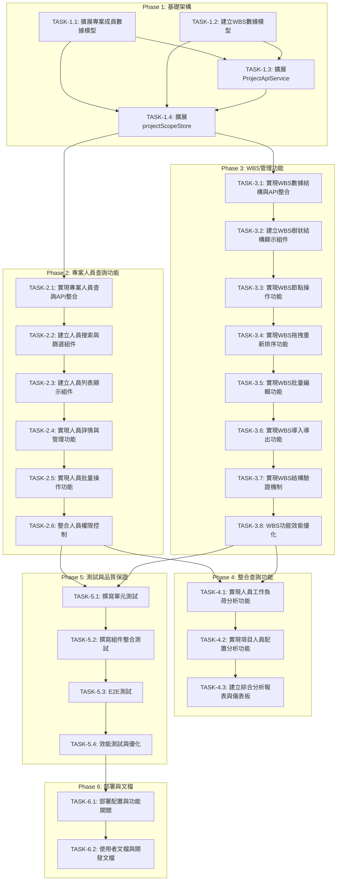

# 專案人員查詢與 WBS 項目設定功能任務分解文檔

## 1. 任務分解概述

本文檔基於已通過驗證的需求文檔（PASS 88/100）和設計文檔（PASS - P0問題已修復），將專案人員查詢與WBS項目設定功能分解為具體、可執行的開發任務。

### 1.1 開發原則
- **原子性**：每個任務都是獨立、可測試的功能單元
- **一致性**：遵循現有 PCM 系統的架構和代碼模式
- **漸進式**：按依賴關係和優先級組織任務執行順序
- **可測試性**：每個任務都包含明確的驗收標準和測試要求

### 1.2 技術基礎
- **前端框架**：Next.js 15.5.2 + React 19.1.0
- **UI 組件庫**：shadcn/ui + Tailwind CSS
- **狀態管理**：Zustand（擴展現有 projectScopeStore）
- **API 服務**：擴展現有 ProjectApiService
- **測試框架**：Vitest + Testing Library

## 2. 任務組織結構

### 2.1 階段劃分

```
Phase 1: 基礎架構（任務 1.1 - 1.4）
├── 資料模型擴展
├── API 服務擴展
├── Store 狀態管理擴展
└── 基礎類型定義

Phase 2: 專案人員查詢功能（任務 2.1 - 2.6）
├── 人員查詢 API 實現
├── 搜索與篩選組件
├── 人員列表顯示組件
├── 人員詳情與管理
├── 批量操作功能
└── 權限控制整合

Phase 3: WBS 管理功能（任務 3.1 - 3.8）
├── WBS 資料結構實現
├── 樹狀結構顯示組件
├── 節點操作功能
├── 拖拽重新排序
├── 批量編輯功能
├── 導入導出功能
├── 結構驗證機制
└── 效能優化

Phase 4: 整合查詢功能（任務 4.1 - 4.3）
├── 人員工作負荷分析
├── 項目人員配置分析
└── 報表與儀表板

Phase 5: 測試與品質保證（任務 5.1 - 5.4）
├── 單元測試
├── 整合測試
├── E2E 測試
└── 效能測試

Phase 6: 部署與文檔（任務 6.1 - 6.2）
├── 部署配置
└── 使用者文檔
```

### 2.2 關鍵里程碑

| 里程碑 | 完成標誌 | 預期時間 |
|--------|----------|----------|
| M1: 基礎架構完成 | API 服務和狀態管理可用 | 第 1 週 |
| M2: 人員查詢功能可用 | 基本查詢和管理功能正常運作 | 第 3 週 |
| M3: WBS 管理功能可用 | 樹狀結構操作完整實現 | 第 6 週 |
| M4: 整合功能完成 | 分析功能和報表可用 | 第 7 週 |
| M5: 測試完成 | 所有測試通過，品質達標 | 第 8 週 |
| M6: 上線準備完成 | 部署配置和文檔完整 | 第 9 週 |

## 3. 詳細任務清單

### Phase 1: 基礎架構建設

#### 任務 1.1: 擴展專案成員數據模型
- **任務ID**: TASK-1.1
- **優先級**: P0 (關鍵路徑)
- **預估工時**: 4 小時
- **依賴項**: 無

**任務描述**：
擴展現有 `ProjectMember` 介面，支援專案人員查詢和管理所需的額外欄位。

**具體工作**：
1. 擴展 `src/types/project.ts` 中的 `ProjectMember` 介面
2. 新增 `ProjectMemberExtended` 介面包含：
   - 技能標籤 (`skills?: string[]`)
   - 目前工作負荷 (`workload?: number`)
   - 最後活躍時間 (`lastActiveAt?: Date`)
   - 個人偏好設定 (`preferences`)
   - 統計數據 (`statistics`)
3. 新增 `ProjectMemberFilters` 介面支援篩選參數
4. 新增 `ProjectMemberQueryResult` 介面定義查詢回應格式
5. 新增相關的 enum 定義（權限等級、技能分類等）

**驗收標準**：
- [x] 所有新增的類型定義通過 TypeScript 編譯
- [x] 類型定義符合現有代碼風格和命名慣例
- [x] 包含完整的 JSDoc 註釋
- [x] 與現有 `Project` 和 `ProjectMember` 介面相容

**🟢 狀態**: COMPLETED
**✅ 完成時間**: 2025-01-26
**📝 完成總結**: 已成功擴展專案成員數據模型，新增了 `ProjectMemberExtended`、`ProjectMemberFilters`、`ProjectMemberQueryResult` 等核心介面，以及相關的技能分類和工作狀態枚舉。所有類型定義均通過 TypeScript 編譯並包含完整註釋。

**影響檔案**：
- `src/types/project.ts`

---

#### 任務 1.2: 建立 WBS 數據模型 ✅
- **任務ID**: TASK-1.2
- **優先級**: P0 (關鍵路徑)
- **預估工時**: 6 小時
- **依賴項**: TASK-1.1
- **🟢 狀態**: COMPLETED
- **✅ 完成時間**: 2025-01-26
- **📝 完成總結**: 已成功建立完整的 WBS 數據模型，包含層級結構、狀態管理、批次操作、驗證規則等功能，並通過 TDD 測試驗證

**任務描述**：
建立完整的 WBS (工作分解結構) 數據模型和相關類型定義。

**具體工作**：
1. 在 `src/types/` 下新增 `wbs.ts` 檔案
2. 定義 `WBSItem` 核心介面包含：
   - 基本資訊（ID、名稱、描述、編碼）
   - 層級結構（父節點、子節點、層級深度）
   - 人員配置（負責人、審核人）
   - 時間管理（預估工時、實際工時、起止日期）
   - 狀態追蹤（狀態、進度、優先級）
   - 依賴關係（前置任務）
   - 元數據（建立時間、版本控制）
3. 定義 WBS 操作相關介面：
   - `WBSTreeOperations`（樹狀操作）
   - `WBSFilters`（篩選條件）
   - `WBSImportExportFormat`（導入導出格式）
4. 定義 WBS 狀態 enum (`WBSStatus`)
5. 定義批量操作介面 (`BatchUpdateWBSRequest`)

**驗收標準**：
- [ ] WBS 數據模型支援無限層級的樹狀結構
- [ ] 包含完整的業務邏輯所需欄位
- [ ] 支援版本控制和審計追蹤
- [ ] 類型安全的樹狀操作介面
- [ ] 完整的導入導出格式定義

**影響檔案**：
- `src/types/wbs.ts`（新檔案）

---

#### 任務 1.3: 擴展 ProjectApiService 支援人員與WBS API ✅
- **任務ID**: TASK-1.3
- **優先級**: P0 (關鍵路徑)
- **預估工時**: 8 小時
- **依賴項**: TASK-1.1, TASK-1.2
- **🟢 狀態**: COMPLETED
- **✅ 完成時間**: 2025-01-26
- **📝 完成總結**: 已成功創建 ProjectStaffWBSApiService，包含專案人員和 WBS 管理的完整 API 功能，支援 CRUD 操作、批次處理、驗證和統計分析，並通過 TDD 測試驗證

**任務描述**：
基於現有 `ProjectApiService` 類別，新增專案人員和 WBS 管理相關的 API 方法。

**具體工作**：
1. 在 `src/services/` 下新增 `projectStaffWbsApi.ts`
2. 建立 `ProjectApiServiceExtension` 類別：
   - 專案人員 API 方法（查詢、搜索、新增、編輯、刪除）
   - WBS 管理 API 方法（取得樹結構、節點操作、批量更新、重新排序）
   - 整合查詢 API 方法（工作負荷分析、配置分析）
3. 建立統一的 `ProjectStaffWBSApiService` 類別整合所有功能
4. 實現錯誤處理和重試機制（沿用現有模式）
5. 實現請求驗證和參數轉換
6. 新增相關的回應介面和錯誤類型

**驗收標準**：
- [ ] API 服務與現有 `ProjectApiService` 無縫整合
- [ ] 支援所有需求文檔中定義的 API 端點
- [ ] 包含完整的錯誤處理和驗證
- [ ] 遵循現有的 API 命名慣例和格式
- [ ] 支援批量操作和分頁查詢
- [ ] 包含完整的 TypeScript 類型支援

**影響檔案**：
- `src/services/projectStaffWbsApi.ts`（新檔案）

---

#### 任務 1.4: 擴展 projectScopeStore 支援人員與WBS狀態管理
- **任務ID**: TASK-1.4
- **優先級**: P0 (關鍵路徑)
- **預估工時**: 6 小時
- **依賴項**: TASK-1.1, TASK-1.2, TASK-1.3

**任務描述**：
擴展現有 `projectScopeStore`，新增專案人員和 WBS 管理相關的狀態管理功能。

**具體工作**：
1. 擴展 `src/store/projectScopeStore.ts`：
   - 新增 `projectMembers` 狀態分支（資料、篩選、分頁、載入狀態）
   - 新增 `wbsManagement` 狀態分支（樹資料、選中節點、展開節點、拖拽狀態）
   - 新增相關的 action 方法
2. 實現狀態持久化配置（選擇性持久化部分狀態）
3. 實現快取策略（資料 TTL、失效條件）
4. 新增專用的 utility hooks：
   - `useProjectMembers`
   - `useWBSTree`
   - `useMemberFilters`
   - `useWBSOperations`
5. 實現 store 的測試檔案

**驗收標準**：
- [ ] 與現有 `projectScopeStore` 無縫整合，不破壞現有功能
- [ ] 支援複雜的篩選和排序狀態管理
- [ ] WBS 樹狀態管理支援展開/摺疊、選取、拖拽等操作
- [ ] 實現智慧快取機制，避免不必要的 API 請求
- [ ] 狀態更新有良好的效能表現
- [ ] 包含完整的 TypeScript 類型支援

**影響檔案**：
- `src/store/projectScopeStore.ts`

---

### Phase 2: 專案人員查詢功能

#### 任務 2.1: 實現專案人員查詢 API 整合
- **任務ID**: TASK-2.1
- **優先級**: P1
- **預估工時**: 4 小時
- **依賴項**: Phase 1 所有任務

**任務描述**：
實現專案人員查詢功能的 API 整合，包括基本查詢、高級篩選和搜索建議。

**具體工作**：
1. 在 `src/hooks/` 下新增 `useProjectMembers.ts`
2. 實現 `useProjectMembersQuery` hook：
   - 支援分頁查詢
   - 支援多條件篩選
   - 支援排序和搜索
   - 實現防抖搜索
   - 快取查詢結果
3. 實現 `useProjectMemberSearch` hook 提供搜索建議
4. 實現 `useProjectMemberStats` hook 提供統計資料
5. 整合 error handling 和 loading 狀態管理

**驗收標準**：
- [ ] 支援所有需求定義的查詢和篩選條件
- [ ] 搜索回應時間 < 2 秒（符合 NFR-1）
- [ ] 實現防抖機制，避免過度請求
- [ ] 快取機制有效減少重複 API 調用
- [ ] 錯誤處理完整，使用者體驗良好

**影響檔案**：
- `src/hooks/useProjectMembers.ts`（新檔案）

---

#### 任務 2.2: 建立專案人員搜索與篩選組件
- **任務ID**: TASK-2.2
- **優先級**: P1
- **預估工時**: 8 小時
- **依賴項**: TASK-2.1

**任務描述**：
建立專案人員的搜索和高級篩選 UI 組件。

**具體工作**：
1. 在 `src/modules/project-staff/components/` 建立組件結構
2. 建立 `ProjectMemberSearchInput.tsx`：
   - 即時搜索輸入框
   - 搜索建議下拉選單
   - 搜索歷史記錄
3. 建立 `ProjectMemberFilters.tsx`：
   - 部門多選篩選器
   - 職位角色篩選器
   - 權限等級篩選器
   - 技能標籤篩選器
   - 工作負荷範圍篩選器
   - 加入時間範圍篩選器
4. 建立 `FilterPanel.tsx` 整合所有篩選器
5. 實現 `SortControls.tsx` 排序控制組件
6. 使用 shadcn/ui 組件保持設計一致性

**驗收標準**：
- [ ] 搜索框支援即時搜索和自動補全
- [ ] 所有篩選器支援多選和組合條件
- [ ] UI 響應式設計，支援行動裝置
- [ ] 篩選狀態正確同步到 URL 參數
- [ ] 符合現有設計系統風格
- [ ] 良好的 accessibility 支援

**影響檔案**：
- `src/modules/project-staff/components/`（新目錄結構）

---

#### 任務 2.3: 建立專案人員列表顯示組件
- **任務ID**: TASK-2.3
- **優先級**: P1
- **預估工時**: 10 小時
- **依賴項**: TASK-2.1, TASK-2.2

**任務描述**：
建立專案人員的列表顯示組件，支援卡片和表格兩種檢視模式。

**具體工作**：
1. 建立 `ProjectMemberCard.tsx`：
   - 人員基本資訊卡片
   - 技能標籤顯示
   - 工作負荷進度條
   - 快速操作按鈕
2. 建立 `ProjectMemberTable.tsx`：
   - 虛擬化表格顯示（支援大量資料）
   - 可排序的表格列
   - 行內編輯功能
   - 批量選擇支援
3. 建立 `ProjectMemberGrid.tsx` 卡片網格布局
4. 建立 `ViewModeToggle.tsx` 檢視模式切換
5. 建立 `PaginationControls.tsx` 分頁控制
6. 實現 `MemberListHeader.tsx` 列表頭部（統計資訊、排序、檢視切換）

**驗收標準**：
- [ ] 卡片檢視美觀實用，資訊層次清晰
- [ ] 表格檢視支援虛擬化，效能良好
- [ ] 支援大量資料顯示（1000+ 人員）
- [ ] 檢視模式切換流暢，狀態保持正確
- [ ] 分頁功能完整，支援跳頁和每頁筆數調整
- [ ] 響應式設計適配各種螢幕尺寸

**影響檔案**：
- `src/modules/project-staff/components/MemberList/`（新目錄）

---

#### 任務 2.4: 實現專案人員詳情與基本管理功能
- **任務ID**: TASK-2.4
- **優先級**: P1
- **預估工時**: 8 小時
- **依賴項**: TASK-2.3

**任務描述**：
實現專案人員的詳情檢視和基本管理功能（檢視、編輯基本資訊）。

**具體工作**：
1. 建立 `MemberDetailModal.tsx`：
   - 完整的人員詳情顯示
   - 技能和工作經驗展示
   - 專案參與歷史
   - 工作負荷時間線
2. 建立 `MemberEditForm.tsx`：
   - 基本資訊編輯表單
   - 技能標籤管理
   - 聯絡方式更新
   - 表單驗證和錯誤處理
3. 建立 `MemberActionMenu.tsx` 操作選單：
   - 編輯個人資訊
   - 檢視詳細資料
   - 發送訊息
   - 權限相關操作（根據權限顯示）
4. 實現相關的 hooks 和服務整合

**驗收標準**：
- [ ] 人員詳情頁面資訊完整且佈局合理
- [ ] 編輯功能支援表單驗證和錯誤提示
- [ ] 操作選單根據使用者權限動態顯示
- [ ] 模態視窗有良好的使用者體驗（載入狀態、關閉確認等）
- [ ] 所有修改操作正確更新快取和 UI 狀態

**影響檔案**：
- `src/modules/project-staff/components/MemberDetail/`（新目錄）

---

#### 任務 2.5: 實現專案人員批量操作功能
- **任務ID**: TASK-2.5
- **優先級**: P2
- **預估工時**: 6 小時
- **依賴項**: TASK-2.4

**任務描述**：
實現專案人員的批量操作功能，包括批量編輯、刪除、匯出等。

**具體工作**：
1. 建立 `BatchOperationPanel.tsx`：
   - 批量選取工具列
   - 選取統計和全選控制
   - 批量操作按鈕群組
2. 建立 `BatchEditModal.tsx`：
   - 批量修改表單
   - 部分修改支援（只更新指定欄位）
   - 修改預覽和確認
3. 實現 `useBatchOperations.ts` hook：
   - 批量選取狀態管理
   - 批量 API 操作
   - 操作進度追蹤
4. 建立確認對話框和操作回饋機制

**驗收標準**：
- [ ] 支援多種批量操作（編輯、刪除、匯出）
- [ ] 批量操作有清楚的進度指示和錯誤處理
- [ ] 操作前有適當的確認機制
- [ ] 批量選取 UI 直覺易用
- [ ] 操作結果有明確的成功/失敗回饋

**影響檔案**：
- `src/modules/project-staff/components/BatchOperations/`（新目錄）
- `src/modules/project-staff/hooks/useBatchOperations.ts`（新檔案）

---

#### 任務 2.6: 整合專案人員權限控制
- **任務ID**: TASK-2.6
- **優先級**: P1
- **預估工時**: 4 小時
- **依賴項**: TASK-2.5

**任務描述**：
整合現有權限系統，確保專案人員管理功能的權限控制正確實施。

**具體工作**：
1. 建立 `useProjectMemberPermissions.ts` hook：
   - 整合現有 `projectScopeStore` 的權限檢查
   - 定義人員管理相關的權限檢查方法
2. 在所有人員管理組件中整合權限控制：
   - 根據權限顯示/隱藏功能按鈕
   - 禁用無權限的操作
   - 顯示權限不足的提示訊息
3. 實現審計日誌記錄：
   - 記錄人員管理操作
   - 整合到現有的審計系統
4. 測試各種權限組合下的功能正確性

**驗收標準**：
- [ ] 所有人員管理功能正確應用權限控制
- [ ] VIEWER 只能檢視，EDITOR 可編輯，ADMIN 可管理
- [ ] 權限不足時有清楚的 UI 提示
- [ ] 所有敏感操作都有審計日誌記錄
- [ ] 權限檢查邏輯與現有系統一致

**影響檔案**：
- `src/modules/project-staff/hooks/useProjectMemberPermissions.ts`（新檔案）
- 更新所有相關組件檔案

---

### Phase 3: WBS 管理功能

#### 任務 3.1: 實現 WBS 數據結構與 API 整合
- **任務ID**: TASK-3.1
- **優先級**: P1
- **預估工時**: 6 小時
- **依賴項**: Phase 1 所有任務

**任務描述**：
實現 WBS 數據結構的 API 整合和狀態管理。

**具體工作**：
1. 建立 `src/hooks/useWBSTree.ts`：
   - 實現 WBS 樹載入和管理
   - 支援延遲載入（大型樹結構）
   - 實現樹狀操作（展開、摺疊、選取）
2. 建立 `src/utils/wbsUtils.ts` WBS 工具函數：
   - 樹結構扁平化和重構
   - WBS 編碼自動生成
   - 節點路徑計算
   - 循環依賴檢查
3. 實現 `useWBSOperations.ts` hook：
   - 節點 CRUD 操作
   - 樹結構重組
   - 批量更新操作
4. 實現資料完整性檢查和驗證機制

**驗收標準**：
- [ ] WBS 樹載入時間 < 3 秒（符合 NFR-1）
- [ ] 支援大型 WBS 結構（5000+ 節點）
- [ ] WBS 編碼自動生成正確（1.1.2 格式）
- [ ] 樹操作狀態管理正確可靠
- [ ] 完整的循環依賴檢查機制

**影響檔案**：
- `src/hooks/useWBSTree.ts`（新檔案）
- `src/utils/wbsUtils.ts`（新檔案）
- `src/hooks/useWBSOperations.ts`（新檔案）

---

#### 任務 3.2: 建立 WBS 樹狀結構顯示組件
- **任務ID**: TASK-3.2
- **優先級**: P1
- **預估工時**: 12 小時
- **依賴項**: TASK-3.1

**任務描述**：
建立 WBS 的樹狀結構顯示組件，支援虛擬化渲染和豐富的互動功能。

**具體工作**：
1. 建立 `src/modules/wbs-management/components/` 目錄結構
2. 建立 `WBSTree.tsx` 主樹組件：
   - 虛擬化樹渲染（支援大量節點）
   - 展開/摺疊動畫
   - 鍵盤導航支援
3. 建立 `WBSNode.tsx` 節點組件：
   - 節點內容顯示（名稱、編碼、狀態、負責人）
   - 節點層級視覺指示
   - 操作按鈕（編輯、刪除、新增子節點）
   - 拖拽控制點
4. 建立 `WBSNodeContent.tsx` 節點內容組件
5. 建立 `WBSToolbar.tsx` 工具列：
   - 新增根節點
   - 展開/摺疊全部
   - 檢視選項
   - 搜索框
6. 實現響應式設計和無障礙支援

**驗收標準**：
- [ ] 樹狀結構顯示清晰，層級關係明確
- [ ] 虛擬化渲染效能良好，支援大量節點
- [ ] 展開摺疊動畫流暢自然
- [ ] 鍵盤導航和無障礙功能完整
- [ ] 響應式設計適配各種螢幕尺寸
- [ ] 載入狀態和錯誤狀態顯示恰當

**影響檔案**：
- `src/modules/wbs-management/components/WBSTree/`（新目錄）

---

#### 任務 3.3: 實現 WBS 節點操作功能
- **任務ID**: TASK-3.3
- **優先級**: P1
- **預估工時**: 10 小時
- **依賴項**: TASK-3.2

**任務描述**：
實現 WBS 節點的建立、編輯、刪除和移動功能。

**具體工作**：
1. 建立 `WBSNodeEditModal.tsx` 節點編輯模態：
   - 完整的節點資訊編輯表單
   - 負責人選擇器
   - 預估工時和時間設定
   - 狀態和優先級選擇
   - 依賴關係設定
2. 建立 `WBSNodeCreateForm.tsx` 新增節點表單
3. 建立 `WBSNodeDeleteConfirm.tsx` 刪除確認對話框：
   - 顯示刪除影響（子節點處理）
   - 安全刪除選項
4. 建立 `WBSNodeActionMenu.tsx` 節點操作選單
5. 實現節點操作的狀態管理和 API 整合
6. 實現表單驗證和錯誤處理

**驗收標準**：
- [ ] 節點編輯功能完整，表單驗證正確
- [ ] 新增節點自動生成正確的 WBS 編碼
- [ ] 刪除操作安全可靠，有適當的警告和確認
- [ ] 節點移動操作直覺易用
- [ ] 所有操作都有適當的載入和錯誤狀態
- [ ] 操作後 UI 狀態更新及時正確

**影響檔案**：
- `src/modules/wbs-management/components/NodeOperations/`（新目錄）

---

#### 任務 3.4: 實現 WBS 拖拽重新排序功能
- **任務ID**: TASK-3.4
- **優先級**: P2
- **預估工時**: 8 小時
- **依賴項**: TASK-3.3

**任務描述**：
實現 WBS 節點的拖拽重新排序功能，支援跨層級移動。

**具體工作**：
1. 整合 `@dnd-kit/core` 或類似的拖拽庫
2. 建立 `WBSDragHandle.tsx` 拖拽控制元件
3. 建立 `WBSDropZone.tsx` 拖放區域組件
4. 實現拖拽狀態管理：
   - 拖拽中的視覺回饋
   - 有效拖放區域高亮
   - 拖拽預覽效果
5. 實現拖放邏輯：
   - 支援同級重排序
   - 支援跨層級移動
   - 防止無效拖放（循環依賴）
6. 實現拖放操作的撤銷功能

**驗收標準**：
- [ ] 拖拽操作流暢直覺，視覺回饋清楚
- [ ] 支援各種拖放場景（同級、跨級、插入）
- [ ] 防止無效操作（循環依賴、權限限制）
- [ ] 拖放操作有撤銷機制
- [ ] 行動裝置上的拖拽體驗良好
- [ ] 拖放操作正確更新 WBS 編碼

**影響檔案**：
- `src/modules/wbs-management/components/DragDrop/`（新目錄）

---

#### 任務 3.5: 實現 WBS 批量編輯功能
- **任務ID**: TASK-3.5
- **優先級**: P2
- **預估工時**: 8 小時
- **依賴項**: TASK-3.4

**任務描述**：
實現 WBS 節點的批量選擇和編輯功能。

**具體工作**：
1. 建立 `WBSBatchSelectionPanel.tsx`：
   - 批量選擇控制界面
   - 選擇統計和視覺指示
   - 全選/取消全選功能
2. 建立 `WBSBatchEditModal.tsx`：
   - 批量編輯表單
   - 支援部分欄位批量更新
   - 批量狀態變更
   - 批量負責人指派
3. 建立 `WBSBatchOperationsBar.tsx` 批量操作工具列
4. 實現批量選擇的狀態管理：
   - 支援複雜的選擇邏輯（包含子節點、排除子節點）
   - 選擇狀態的視覺化
5. 實現批量操作的 API 整合和錯誤處理

**驗收標準**：
- [ ] 支援靈活的節點選擇方式
- [ ] 批量編輯功能完整實用
- [ ] 批量操作有進度指示和錯誤處理
- [ ] 操作結果有詳細的成功/失敗報告
- [ ] 批量選擇狀態管理正確可靠

**影響檔案**：
- `src/modules/wbs-management/components/BatchOperations/`（新目錄）

---

#### 任務 3.6: 實現 WBS 導入導出功能
- **任務ID**: TASK-3.6
- **優先級**: P2
- **預估工時**: 10 小時
- **依賴項**: TASK-3.5

**任務描述**：
實現 WBS 結構的 Excel 導入導出功能。

**具體工作**：
1. 建立 `WBSImportModal.tsx` 導入界面：
   - Excel 檔案上傳
   - 導入模板下載
   - 資料預覽和驗證
   - 導入進度追蹤
2. 建立 `WBSExportModal.tsx` 導出界面：
   - 導出格式選擇（Excel、PDF）
   - 導出範圍設定
   - 欄位選擇
   - 導出進度指示
3. 建立 `src/utils/wbsImportExport.ts` 工具：
   - Excel 檔案解析
   - WBS 資料格式轉換
   - 資料驗證和錯誤檢查
   - 導出格式化
4. 實現導入導出的 API 整合
5. 建立標準的導入模板

**驗收標準**：
- [ ] 支援標準 Excel 格式的導入導出
- [ ] 導入過程有完整的驗證和錯誤提示
- [ ] 導出支援多種格式和自訂選項
- [ ] 大量資料導入導出效能良好
- [ ] 提供標準模板和使用說明

**影響檔案**：
- `src/modules/wbs-management/components/ImportExport/`（新目錄）
- `src/utils/wbsImportExport.ts`（新檔案）

---

#### 任務 3.7: 實現 WBS 結構驗證機制
- **任務ID**: TASK-3.7
- **優先級**: P2
- **預估工時**: 6 小時
- **依賴項**: TASK-3.6

**任務描述**：
實現 WBS 結構的完整性檢查和驗證機制。

**具體工作**：
1. 建立 `src/utils/wbsValidation.ts` 驗證工具：
   - 樹結構完整性檢查
   - 循環依賴檢測
   - WBS 編碼格式驗證
   - 負責人有效性檢查
   - 日期邏輯驗證
2. 建立 `WBSValidationReport.tsx` 驗證報告組件：
   - 驗證結果顯示
   - 問題詳情和修復建議
   - 自動修復選項（如果可能）
3. 建立定期驗證和監控機制
4. 整合到各種 WBS 操作中進行即時驗證

**驗收標準**：
- [ ] 完整的 WBS 結構驗證覆蓋所有業務規則
- [ ] 驗證報告清晰詳細，有修復建議
- [ ] 驗證過程效能良好，不影響使用者體驗
- [ ] 即時驗證能及時發現和阻止錯誤操作
- [ ] 支援批量驗證和自動修復

**影響檔案**：
- `src/utils/wbsValidation.ts`（新檔案）
- `src/modules/wbs-management/components/Validation/`（新目錄）

---

#### 任務 3.8: WBS 功能效能優化
- **任務ID**: TASK-3.8
- **優先級**: P2
- **預估工時**: 6 小時
- **依賴項**: TASK-3.7

**任務描述**：
對 WBS 管理功能進行效能優化，確保大型專案的流暢體驗。

**具體工作**：
1. 實現 WBS 樹的虛擬化渲染優化：
   - 使用 `react-window` 或 `@tanstack/react-virtual`
   - 實現動態節點高度
   - 優化滾動效能
2. 實現延遲載入和分頁載入：
   - 按需載入樹節點
   - 漸進式資料載入
3. 實現狀態更新優化：
   - 使用 `useMemo` 和 `useCallback` 優化重新渲染
   - 實現智慧的狀態更新策略
4. 實現記憶體使用優化：
   - 清理不需要的資料引用
   - 優化大型樹結構的記憶體占用
5. 新增效能監控和指標追蹤

**驗收標準**：
- [ ] 支援 5000+ 節點的 WBS 結構流暢運作
- [ ] 樹操作回應時間 < 100ms
- [ ] 記憶體使用合理，無明顯內存洩漏
- [ ] 滾動和拖拽操作流暢
- [ ] 效能監控指標完整可靠

**影響檔案**：
- 更新所有 WBS 相關組件，優化效能

---

### Phase 4: 整合查詢功能

#### 任務 4.1: 實現人員工作負荷分析功能
- **任務ID**: TASK-4.1
- **優先級**: P2
- **預估工時**: 8 小時
- **依賴項**: Phase 2, Phase 3 核心任務

**任務描述**：
實現專案成員工作負荷的分析和可視化功能。

**具體工作**：
1. 建立 `src/modules/analysis/` 目錄結構
2. 建立 `WorkloadAnalysis.tsx` 工作負荷分析組件：
   - 成員工作負荷總覽
   - 工時分配圓餅圖
   - 時間線甘特圖
   - 負荷預警指示
3. 建立 `MemberWorkloadChart.tsx` 個人工作負荷圖表
4. 建立 `WorkloadComparisonTable.tsx` 負荷比較表格
5. 實現 `useWorkloadAnalysis.ts` hook：
   - 工作負荷計算邏輯
   - 衝突檢測算法
   - 負荷平衡建議
6. 整合 recharts 製作互動式圖表

**驗收標準**：
- [ ] 工作負荷計算準確，包含預估和實際工時
- [ ] 圖表清晰美觀，支援互動操作
- [ ] 能正確識別工作分配衝突
- [ ] 提供有用的負荷平衡建議
- [ ] 支援不同時間範圍的分析

**影響檔案**：
- `src/modules/analysis/components/Workload/`（新目錄）
- `src/hooks/useWorkloadAnalysis.ts`（新檔案）

---

#### 任務 4.2: 實現項目人員配置分析功能
- **任務ID**: TASK-4.2
- **優先級**: P2
- **預估工時**: 6 小時
- **依賴項**: TASK-4.1

**任務描述**：
實現 WBS 項目人員配置的分析和優化建議功能。

**具體工作**：
1. 建立 `ProjectAssignmentAnalysis.tsx` 配置分析組件：
   - 項目配置狀況總覽
   - 未分配項目列表
   - 人員技能匹配分析
   - 配置優化建議
2. 建立 `SkillMatchingMatrix.tsx` 技能匹配矩陣
3. 建立 `AssignmentRecommendation.tsx` 分配建議組件
4. 實現 `useAssignmentAnalysis.ts` hook：
   - 配置狀況分析
   - 技能匹配算法
   - 自動分配建議
5. 建立配置優化的決策支援工具

**驗收標準**：
- [ ] 正確識別所有未分配的 WBS 項目
- [ ] 技能匹配分析準確有效
- [ ] 分配建議符合實際業務需求
- [ ] 分析結果清晰易懂
- [ ] 支援批量採用分配建議

**影響檔案**：
- `src/modules/analysis/components/Assignment/`（新目錄）
- `src/hooks/useAssignmentAnalysis.ts`（新檔案）

---

#### 任務 4.3: 建立綜合分析報表與儀表板
- **任務ID**: TASK-4.3
- **優先級**: P2
- **預估工時**: 8 小時
- **依賴項**: TASK-4.1, TASK-4.2

**任務描述**：
建立綜合的分析報表和儀表板，提供專案人員和 WBS 的全面分析。

**具體工作**：
1. 建立 `ProjectAnalysisDashboard.tsx` 分析儀表板：
   - 關鍵指標 KPI 卡片
   - 多維度分析圖表
   - 趨勢分析
   - 預警提示
2. 建立 `AnalysisReportGenerator.tsx` 報表生成器：
   - 自定義報表配置
   - 多格式導出（PDF、Excel）
   - 定期報表排程
3. 建立 `AnalysisFilters.tsx` 分析篩選器
4. 實現 `useAnalyticsDashboard.ts` hook 統合各種分析資料
5. 整合現有的圖表組件和設計系統

**驗收標準**：
- [ ] 儀表板資訊豐富且佈局合理
- [ ] 支援靈活的篩選和時間範圍選擇
- [ ] 報表導出功能完整可用
- [ ] 所有圖表支援互動和鑽取
- [ ] 載入效能良好，資料更新及時

**影響檔案**：
- `src/modules/analysis/components/Dashboard/`（新目錄）
- `src/hooks/useAnalyticsDashboard.ts`（新檔案）

---

### Phase 5: 測試與品質保證

#### 任務 5.1: 撰寫單元測試
- **任務ID**: TASK-5.1
- **優先級**: P1
- **預估工時**: 12 小時
- **依賴項**: Phase 2, Phase 3 主要功能完成

**任務描述**：
為所有核心功能撰寫全面的單元測試。

**具體工作**：
1. 測試 hooks 和工具函數：
   - `useProjectMembers.test.ts`
   - `useWBSTree.test.ts`
   - `wbsUtils.test.ts`
   - `wbsValidation.test.ts`
2. 測試 API 服務：
   - `projectStaffWbsApi.test.ts`
   - mock API 回應和錯誤情況
3. 測試狀態管理：
   - `projectScopeStore.test.ts` 擴展測試
   - 狀態更新和持久化測試
4. 測試業務邏輯：
   - WBS 編碼生成
   - 權限檢查邏輯
   - 工作負荷計算
5. 設定測試覆蓋率目標 >= 80%

**驗收標準**：
- [ ] 單元測試覆蓋率 >= 80%
- [ ] 所有核心業務邏輯都有測試覆蓋
- [ ] 測試案例包含正常流程和異常情況
- [ ] 測試執行速度快，穩定可靠
- [ ] 測試文檔清晰，易於維護

**影響檔案**：
- 各模組下的 `__tests__/` 目錄

---

#### 任務 5.2: 撰寫組件整合測試
- **任務ID**: TASK-5.2
- **優先級**: P1
- **預估工時**: 10 小時
- **依賴項**: TASK-5.1

**任務描述**：
撰寫關鍵組件的整合測試，確保組件間協作正常。

**具體工作**：
1. 測試專案人員查詢流程：
   - 搜索篩選整合測試
   - 列表顯示和分頁測試
   - 人員詳情和編輯整合測試
2. 測試 WBS 管理流程：
   - 樹結構載入和顯示測試
   - 節點操作整合測試
   - 拖拽功能測試
3. 測試分析功能：
   - 資料分析和圖表顯示測試
   - 報表生成整合測試
4. 測試權限控制整合
5. 使用 MSW 模擬 API 回應

**驗收標準**：
- [ ] 所有主要使用者流程都有整合測試
- [ ] 測試涵蓋組件間的資料傳遞和狀態同步
- [ ] API 整合測試使用 mock 資料
- [ ] 錯誤處理和邊界情況有測試覆蓋
- [ ] 測試執行穩定，無隨機失敗

**影響檔案**：
- `src/modules/*/components/__tests__/`（各模組測試目錄）

---

#### 任務 5.3: E2E 測試
- **任務ID**: TASK-5.3
- **優先級**: P2
- **預估工時**: 8 小時
- **依賴項**: TASK-5.2

**任務描述**：
撰寫關鍵使用者流程的端對端測試。

**具體工作**：
1. 設定 Playwright 或 Cypress E2E 測試環境
2. 撰寫核心使用者流程測試：
   - 專案人員搜索和查看流程
   - WBS 結構建立和編輯流程
   - 人員工作負荷分析流程
3. 測試不同權限等級的使用者體驗
4. 測試響應式設計在不同螢幕尺寸的表現
5. 測試瀏覽器相容性（Chrome、Firefox、Safari）

**驗收標準**：
- [ ] 所有關鍵使用者流程都能正常完成
- [ ] 測試涵蓋不同權限和裝置類型
- [ ] E2E 測試執行穩定可靠
- [ ] 測試報告清楚詳細
- [ ] 支援 CI/CD 自動化執行

**影響檔案**：
- `e2e/` 目錄（E2E 測試檔案）

---

#### 任務 5.4: 效能測試與優化
- **任務ID**: TASK-5.4
- **優先級**: P2
- **預估工時**: 6 小時
- **依賴項**: TASK-5.3

**任務描述**：
進行效能測試，確保系統符合效能需求。

**具體工作**：
1. 建立效能測試環境和測試資料：
   - 建立大量測試資料（1000+ 人員，5000+ WBS 節點）
   - 設定效能監控指標
2. 進行負載測試：
   - 人員查詢回應時間測試
   - WBS 樹載入和操作效能測試
   - 並發使用者測試
3. 進行前端效能測試：
   - 頁面載入時間
   - 記憶體使用量
   - 渲染效能
4. 識別和修復效能瓶頸
5. 建立效能監控和告警機制

**驗收標準**：
- [ ] 人員查詢回應時間 < 2 秒
- [ ] WBS 樹載入時間 < 3 秒
- [ ] 支援大型專案數據量（符合 NFR-1）
- [ ] 記憶體使用量合理，無內存洩漏
- [ ] 效能監控機制有效運作

**影響檔案**：
- `performance/` 目錄（效能測試檔案）

---

### Phase 6: 部署與文檔

#### 任務 6.1: 部署配置與功能開關
- **任務ID**: TASK-6.1
- **優先級**: P1
- **預估工時**: 4 小時
- **依賴項**: Phase 5 主要測試完成

**任務描述**：
建立功能的部署配置和段階式上線機制。

**具體工作**：
1. 建立功能開關配置：
   - 環境變數配置
   - 功能開關管理
   - A/B 測試支援
2. 設定段階式部署策略：
   - Alpha 版本（5% 使用者）
   - Beta 版本（20% 使用者）  
   - 正式版本（100% 使用者）
3. 建立監控和告警機制：
   - 錯誤監控
   - 效能監控
   - 使用量統計
4. 準備資料庫遷移腳本
5. 建立回滾計劃和程序

**驗收標準**：
- [ ] 功能開關可以動態控制功能啟用
- [ ] 段階式部署機制運作正常
- [ ] 監控告警機制完整有效
- [ ] 資料遷移腳本安全可靠
- [ ] 回滾程序經過測試驗證

**影響檔案**：
- 部署配置檔案
- 監控配置

---

#### 任務 6.2: 使用者文檔與開發文檔
- **任務ID**: TASK-6.2
- **優先級**: P2
- **預估工時**: 6 小時
- **依賴項**: TASK-6.1

**任務描述**：
建立完整的使用者文檔和開發維護文檔。

**具體工作**：
1. 撰寫使用者操作手冊：
   - 專案人員查詢使用指南
   - WBS 管理操作說明
   - 分析功能使用教學
   - 常見問題解答
2. 撰寫管理員文檔：
   - 權限配置指南
   - 系統配置說明
   - 故障排除手冊
3. 撰寫開發維護文檔：
   - 代碼架構說明
   - API 文檔
   - 資料庫設計文檔
   - 部署維護指南
4. 建立線上幫助系統（如果需要）

**驗收標準**：
- [ ] 使用者文檔清晰詳細，配有截圖說明
- [ ] 管理員文檔涵蓋所有配置和維護需求
- [ ] 開發文檔便於新人理解和維護
- [ ] 文檔格式統一，易於更新維護
- [ ] 提供多種格式（網頁、PDF）

**影響檔案**：
- `docs/` 目錄（文檔檔案）

---

## 4. 任務依賴關係圖



## 5. 資源配置建議

### 5.1 人員配置

**建議團隊組成**：
- **前端開發工程師** 2-3 人
- **後端開發工程師** 1-2 人  
- **UI/UX 設計師** 1 人
- **測試工程師** 1 人
- **專案經理** 1 人

### 5.2 時程安排

**總開發時程**: 9 週

| 週次 | 主要任務 | 關鍵成果 |
|------|----------|----------|
| 第1週 | Phase 1 基礎架構建設 | 資料模型和API服務完成 |
| 第2週 | Phase 2 人員查詢功能開發 | 搜索篩選功能可用 |
| 第3週 | Phase 2 人員管理功能完善 | 人員查詢功能完整可用 |
| 第4-5週 | Phase 3 WBS核心功能開發 | WBS樹操作功能完成 |
| 第6週 | Phase 3 WBS進階功能開發 | WBS管理功能完整 |
| 第7週 | Phase 4 整合查詢功能 | 分析功能上線 |
| 第8週 | Phase 5 測試與品質保證 | 所有測試通過 |
| 第9週 | Phase 6 部署準備 | 正式上線 |

### 5.3 風險控制

**主要風險和緩解措施**：

1. **效能風險**（大量資料處理）
   - 提早進行效能測試
   - 實現虛擬化和分頁載入
   - 監控關鍵效能指標

2. **相容性風險**（與現有系統整合）
   - 嚴格遵循現有代碼模式
   - 充分的整合測試
   - 漸進式發布策略

3. **使用者體驗風險**（複雜功能易用性）
   - 早期使用者回饋收集
   - A/B 測試驗證設計決策
   - 充分的使用者文檔

## 6. 品質保證標準

### 6.1 代碼品質標準
- TypeScript 嚴格模式，無 any 使用
- ESLint 規則 100% 通過
- 代碼覆蓋率 >= 80%
- 所有 public 方法都有 JSDoc 註釋

### 6.2 效能標準
- 人員查詢回應時間 < 2 秒
- WBS 樹載入時間 < 3 秒  
- 首屏載入時間 < 1 秒
- 支援 1000+ 人員和 5000+ WBS 節點

### 6.3 相容性標準
- 支援 Chrome、Firefox、Safari、Edge 最新版本
- 響應式設計支援行動裝置
- 符合 WCAG 2.1 AA 無障礙標準

### 6.4 安全標準
- 所有操作都有權限檢查
- 敏感操作記錄審計日誌
- 輸入資料驗證和清理
- HTTPS 加密傳輸

---

## 結論

本任務分解文檔提供了專案人員查詢與WBS項目設定功能的完整實施路線圖。通過6個階段、29個具體任務的有序執行，將能夠建立一個功能完整、效能優秀、使用者體驗良好的專案管理功能模組。

每個任務都包含明確的驗收標準和品質要求，確保最終交付的功能符合所有業務需求和技術規範。建議開發團隊嚴格按照任務順序和依賴關係進行開發，並在每個階段結束時進行全面的測試和品質檢查。