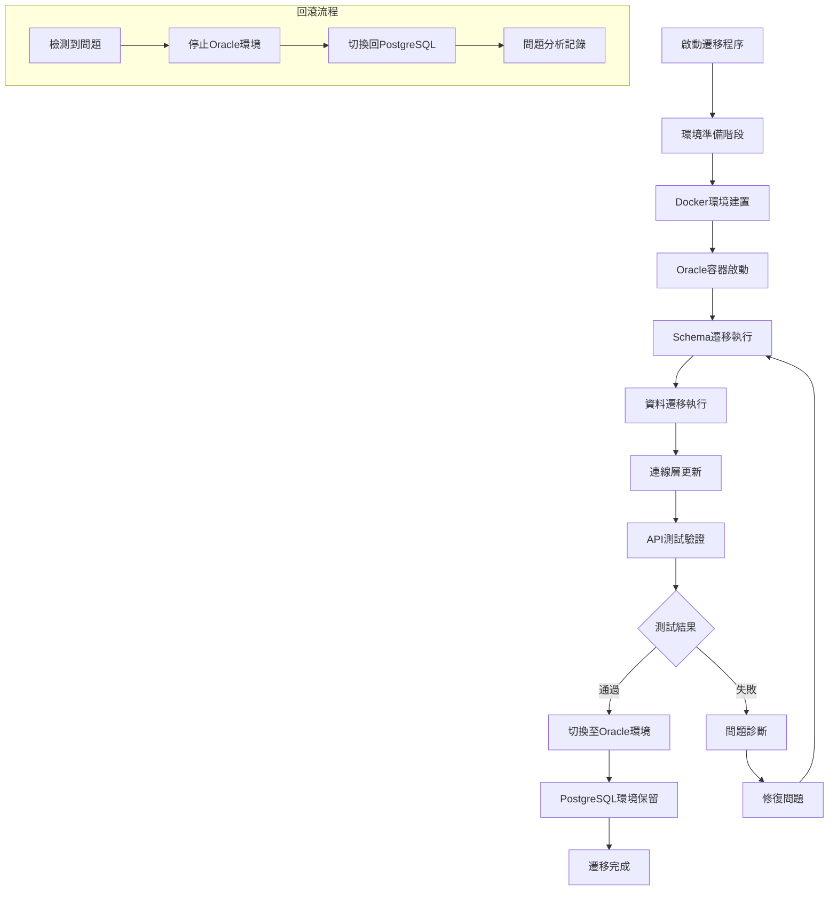
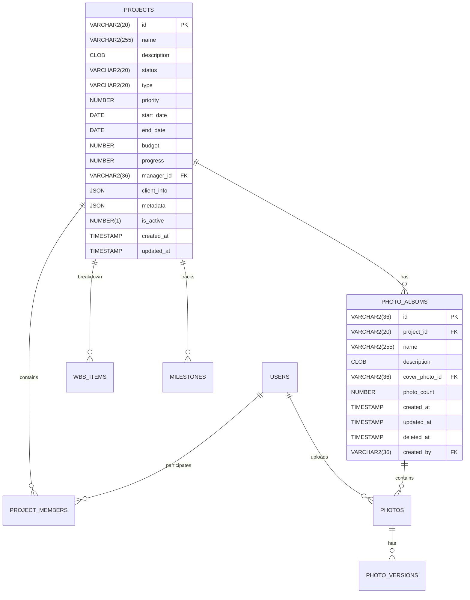
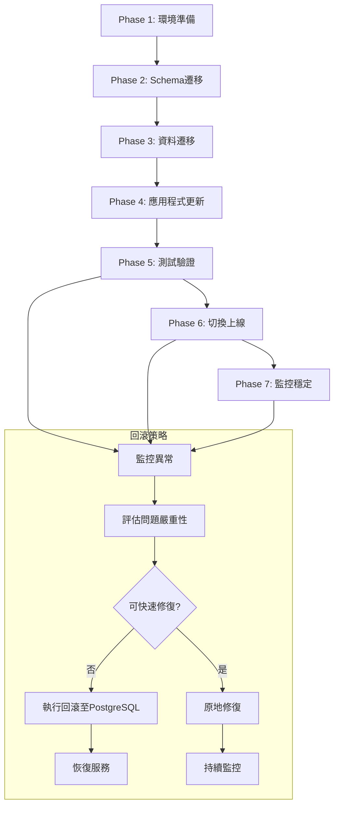

# Docker本地化資料庫與Oracle遷移技術設計文件

## 概述

本專案將PCM工程關鍵指標平台的資料庫系統從遠端PostgreSQL遷移至本地Docker容器中的Oracle Database Express Edition，實現完全的本地開發環境。此遷移涉及完整的資料庫架構轉換、連線層重構，以及所有API端點的Oracle相容性更新。

**目的：** 建立統一的本地開發環境，提升開發效率並減少對遠端資料庫的依賴。

**使用者：** 開發團隊將使用此本地環境進行功能開發、測試和除錯，DevOps團隊將管理容器化環境配置。

**影響：** 從依賴遠端PostgreSQL (192.168.1.183:30432) 的分散式開發環境，轉變為完全本地化的Docker Oracle環境，確保所有開發者擁有一致的資料庫環境。

### 目標
- 建立Docker化的Oracle Database XE本地開發環境
- 完整遷移PostgreSQL schema和資料至Oracle
- 重構資料庫連線層以支援Oracle專用驅動
- 更新所有API端點以相容Oracle特有語法
- 確保100%的資料完整性和功能對等性

### 非目標
- 不影響生產環境的PostgreSQL配置
- 不包含舊有PostgreSQL環境的清理作業
- 暫不考慮多資料庫並行支援
- 延後考慮Oracle付費版本功能整合

## 架構

### 現有架構分析

**當前資料庫架構模式：**
- 使用PostgreSQL 15+ 搭配 `pg` Node.js 驅動程式
- 採用Repository模式進行資料存取抽象化
- 實作BaseRepository泛型類別提供CRUD基礎功能
- 使用連線池管理資料庫連線（Pool from pg）
- 支援交易管理和查詢效能監控

**現有領域邊界：**
- pcm schema作為主要業務邏輯命名空間
- 基於table-per-entity的資料模型
- JSON欄位處理metadata和client_info動態資料
- UUID主鍵和序列自動遞增支援

**必須維護的整合點：**
- Next.js API路由結構保持不變
- 前端TypeScript介面定義維持相容
- 現有的BaseRepository抽象層模式
- 統一的錯誤處理和日誌記錄機制

### 高層架構

```mermaid
graph TB
    subgraph "Docker開發環境"
        A[Docker Compose] --> B[Oracle Database XE 21c]
        A --> C[SQL Developer Web]
        A --> D[應用程式容器 (可選)]
    end

    subgraph "應用程式層"
        E[Next.js API Routes] --> F[Service Layer]
        F --> G[Repository Layer]
        G --> H[Oracle Connection Layer]
    end

    subgraph "資料存取重構"
        H --> I[node-oracledb Driver]
        I --> J[Connection Pool Management]
        J --> K[Oracle Database XE]
    end

    subgraph "開發工具"
        L[Schema Migration Scripts]
        M[Data Validation Tools]
        N[Performance Monitoring]
    end

    B --> K
    C --> K
    L --> K
    M --> K
    N --> K
```

### 技術對齊

**現有技術棧保持：**
- Next.js 15.5.2 應用程式框架維持不變
- TypeScript 類型系統和介面定義保持一致
- Repository模式和BaseRepository抽象層繼續使用
- 現有的查詢建構器模式適配Oracle語法

**新增依賴和函式庫：**
- `oracledb` v6.9.0: Oracle官方Node.js驅動程式（Thin模式）
- Oracle Database XE 21c: Docker容器化資料庫實例
- 移除 `pg` 相關依賴並替換為Oracle等效功能

**設計模式一致性：**
- 維持單例模式的DatabaseConnection類別
- 繼續使用工廠模式的Repository實作
- 保持依賴注入的Service層架構
- 遵循現有的錯誤處理和驗證模式

## 關鍵設計決策

### 決策1：Oracle Database版本選擇
**決策：** 使用Oracle Database Express Edition (XE) 21c
**背景：** 需要選擇適合本地開發環境的Oracle版本，考量授權成本、功能完整性和Docker支援度
**替代方案：**
- Oracle Database Enterprise Edition (成本高，功能過於豐富)
- Oracle Database Standard Edition (授權複雜)
- 第三方Oracle相容資料庫如SolarisOracle (相容性風險)
**選擇理由：**
- XE版本免費使用，適合開發環境
- 容器化支援完善，官方維護Docker映像檔
- 功能限制（12GB資料、20GB儲存、2GB記憶體）對開發環境足夠
- 與付費版本具有高度相容性，便於未來升級
**權衡：** 獲得免費授權和簡化部署，但犧牲部分進階企業功能和效能極限

### 決策2：node-oracledb Thin模式採用
**決策：** 使用node-oracledb v6.9+ Thin模式作為預設連線方式
**背景：** 需要選擇Oracle Node.js驅動的連線模式，考量安裝複雜度和效能表現
**替代方案：**
- Thick模式（需要安裝Oracle Instant Client）
- 第三方Oracle驅動程式（如oracle-db-connector）
**選擇理由：**
- Thin模式純JavaScript實作，無需額外的Oracle Client安裝
- 減少Docker容器複雜度和大小
- Oracle官方2025年主推模式，具備完整功能支援
- 支援最新的Sessionless Transactions和Instance Principal Authentication
**權衡：** 獲得簡化部署和維護，但在極高並發情境下可能不如Thick模式效能

### 決策3：段階式遷移策略
**決策：** 採用段階式遷移，支援PostgreSQL和Oracle環境並行運行
**背景：** 需要制定風險可控的遷移策略，確保業務連續性和快速回滾能力
**替代方案：**
- 大爆炸式一次性切換（風險高，回滾困難）
- 微服務逐一遷移（複雜度高，協調困難）
**選擇理由：**
- 降低遷移風險，支援快速回滾
- 允許充分的測試和驗證期間
- 開發團隊可以逐步適應新環境
- 便於問題隔離和解決
**權衡：** 獲得低風險遷移和高可靠性，但增加短期維護複雜度和資源需求

## 系統流程

### 遷移執行流程



### 資料類型轉換流程

```mermaid
flowchart LR
    subgraph "PostgreSQL源類型"
        A1[UUID]
        A2[JSONB]
        A3[SERIAL]
        A4[TIMESTAMP WITH TIME ZONE]
        A5[TEXT]
        A6[BOOLEAN]
    end

    subgraph "轉換邏輯"
        B1[UUID → VARCHAR2(36)]
        B2[JSONB → JSON/CLOB]
        B3[SERIAL → SEQUENCE + TRIGGER]
        B4[TIMESTAMPTZ → TIMESTAMP]
        B5[TEXT → VARCHAR2(4000)/CLOB]
        B6[BOOLEAN → NUMBER(1)]
    end

    subgraph "Oracle目標類型"
        C1[VARCHAR2(36)]
        C2[JSON Data Type]
        C3[NUMBER + SEQUENCE]
        C4[TIMESTAMP]
        C5[VARCHAR2/CLOB]
        C6[NUMBER(1) CHECK]
    end

    A1 --> B1 --> C1
    A2 --> B2 --> C2
    A3 --> B3 --> C3
    A4 --> B4 --> C4
    A5 --> B5 --> C5
    A6 --> B6 --> C6
```

## 需求可追溯性

| 需求 | 需求摘要 | 元件 | 介面 | 流程 |
|------|----------|------|------|------|
| 1.1-1.6 | Docker容器化環境建置 | DockerComposeConfig, OracleContainer | docker-compose.yml, Environment Variables | 容器生命週期管理 |
| 2.1-2.8 | 資料庫Schema遷移 | SchemaMigrator, DataTypeMappingService | Migration Scripts, SQL Converter | Schema遷移執行流程 |
| 3.1-3.7 | 連線層重構 | OracleConnectionManager, ConnectionPool | oracledb Driver Interface | 連線建立和管理流程 |
| 4.1-4.8 | API端點更新 | QueryAdapter, RepositoryLayer | Oracle SQL Syntax, Pagination API | API查詢執行流程 |
| 5.1-5.6 | 環境配置管理 | ConfigurationManager, EnvironmentValidator | Environment Config Interface | 環境切換流程 |
| 6.1-6.7 | 資料一致性驗證 | DataValidator, ComparisonTool | Validation Interface | 資料比對和驗證流程 |
| 7.1-7.7 | 開發工具整合 | DeveloperTools, ManagementInterface | SQL Developer Web, Migration CLI | 開發工具存取流程 |
| 8.1-8.6 | 向後相容性策略 | MigrationStrategy, RollbackManager | Compatibility Interface | 段階式遷移流程 |

## 元件與介面

### 基礎設施層

#### DockerComposeConfiguration

**責任與邊界**
- **主要責任**: 定義和管理整個Docker開發環境的容器配置
- **領域邊界**: 屬於基礎設施配置領域，管理容器編排和網路設定
- **資料擁有權**: 擁有Docker環境配置資料和容器生命週期管理
- **交易邊界**: 整個Docker環境作為一個部署單位

**依賴關係**
- **入站**: 開發者指令、CI/CD流水線觸發
- **出站**: Oracle容器服務、網路基礎設施、存儲卷
- **外部**: Docker Engine、docker-compose CLI工具

**合約定義**

**服務介面**:
```typescript
interface DockerEnvironmentService {
  startEnvironment(): Promise<Result<EnvironmentStatus, DockerError>>;
  stopEnvironment(): Promise<Result<void, DockerError>>;
  resetEnvironment(): Promise<Result<void, DockerError>>;
  getStatus(): Promise<Result<ContainerStatus[], DockerError>>;
  validateConfiguration(): Result<ConfigValidation, ValidationError>;
}
```

**配置結構**:
```yaml
# docker-compose.yml 基本結構
version: '3.8'
services:
  oracle-db:
    image: container-registry.oracle.com/database/express:21.3.0-xe
    container_name: pcm-oracle-dev
    ports:
      - "1521:1521"
      - "5500:5500"
    environment:
      - ORACLE_PWD=${ORACLE_PASSWORD}
      - ORACLE_CHARACTERSET=AL32UTF8
    volumes:
      - oracle-data:/opt/oracle/oradata
      - ./database/oracle-init:/docker-entrypoint-initdb.d
    healthcheck:
      test: ["CMD", "sqlplus", "-L", "system/${ORACLE_PASSWORD}@//localhost:1521/XE", "@healthcheck.sql"]
      interval: 30s
      timeout: 10s
      retries: 5
```

**前置條件**: Docker Engine和docker-compose已安裝並運行
**後置條件**: Oracle容器運行並可接受連線，資料持久化到指定卷
**不變條件**: 容器網路配置和埠映射保持一致

#### OracleContainerManager

**責任與邊界**
- **主要責任**: 管理Oracle Database XE容器的生命週期和健康狀態
- **領域邊界**: 容器管理領域，專注於Oracle特定的容器操作
- **資料擁有權**: 擁有容器狀態資訊和健康檢查結果
- **交易邊界**: 單一容器操作為交易邊界

**依賴關係**
- **入站**: DockerComposeConfiguration、健康檢查系統
- **出站**: Oracle Database實例、Docker API
- **外部**: Oracle容器映像檔、Docker運行時

**合約定義**

**容器管理介面**:
```typescript
interface OracleContainerManager {
  initializeDatabase(): Promise<Result<DatabaseInitStatus, InitError>>;
  performHealthCheck(): Promise<Result<HealthStatus, HealthCheckError>>;
  executeStartupScripts(): Promise<Result<ScriptExecution[], ScriptError>>;
  monitorLogs(): AsyncIterable<LogEntry>;
  getContainerMetrics(): Promise<Result<ContainerMetrics, MetricsError>>;
}

interface HealthStatus {
  isHealthy: boolean;
  listenPort: number;
  databaseStatus: 'STARTING' | 'READY' | 'ERROR';
  lastCheckTime: Date;
  errorDetails?: string;
}
```

**初始化腳本執行**:
- 支援在容器啟動時自動執行SQL初始化腳本
- 按照檔案名稱順序執行 `/docker-entrypoint-initdb.d` 中的.sql檔案
- 記錄執行結果並提供失敗時的詳細錯誤資訊

### 資料存取層

#### OracleConnectionManager

**責任與邊界**
- **主要責任**: 管理與Oracle資料庫的連線建立、池化和生命週期
- **領域邊界**: 資料存取基礎設施，提供低層資料庫連線服務
- **資料擁有權**: 擁有連線池狀態、連線配置和效能指標
- **交易邊界**: 單一資料庫連線為最小交易單位

**依賴關係**
- **入站**: Repository層、Service層的資料庫操作請求
- **出站**: Oracle Database實例、node-oracledb驅動程式
- **外部**: oracledb npm套件、Oracle XE容器

**外部依賴調查**:
- **oracledb套件**: Oracle官方維護的Node.js驅動程式，最新版本6.9.0
- **Thin模式支援**: 純JavaScript實作，無需Oracle Client庫
- **連線字串格式**: 支援Easy Connect格式和Service Name連線
- **功能特性**: 連線池、預處理語句、批次操作、LOB處理
- **效能特性**: 支援Fast Application Notification (FAN)、連線驗證
- **安全特性**: 支援SSL/TLS、Oracle Wallet、Token-based認證

**合約定義**

**連線管理介面**:
```typescript
interface OracleConnectionManager {
  initialize(config: OracleConfig): Promise<Result<void, ConnectionError>>;
  getConnection(): Promise<Result<OracleConnection, ConnectionError>>;
  executeQuery<T>(sql: string, binds?: BindParameters): Promise<Result<T[], QueryError>>;
  executeOne<T>(sql: string, binds?: BindParameters): Promise<Result<T | null, QueryError>>;
  executeTransaction<T>(callback: TransactionCallback<T>): Promise<Result<T, TransactionError>>;
  getPoolStatus(): PoolMetrics;
  healthCheck(): Promise<Result<boolean, HealthCheckError>>;
  shutdown(): Promise<Result<void, ShutdownError>>;
}

interface OracleConfig {
  connectString: string;      // localhost:1521/XEPDB1
  user: string;              // 資料庫使用者名稱
  password: string;          // 資料庫密碼
  poolMin: number;           // 最小連線數
  poolMax: number;           // 最大連線數
  poolIncrement: number;     // 連線增量
  poolTimeout: number;       // 連線超時(秒)
  enableStatistics: boolean; // 啟用統計資訊
}
```

**連線池策略**:
- 使用oracledb內建連線池管理機制
- 實作連線驗證和自動重連邏輯
- 支援連線標記(tagging)用於特殊用途連線
- 提供詳細的連線池監控指標

**前置條件**: Oracle容器運行且可存取，認證資訊正確
**後置條件**: 連線池建立並可提供有效連線，監控指標可存取
**不變條件**: 連線池大小限制和超時設定始終有效

#### OracleBaseRepository

**責任與邊界**
- **主要責任**: 提供Oracle特化的泛型Repository實作，替代PostgreSQL BaseRepository
- **領域邊界**: 資料存取抽象層，處理Oracle特有的SQL語法和資料類型
- **資料擁有權**: 擁有資料映射邏輯和查詢建構規則
- **交易邊界**: 單一實體操作或明確的批次操作

**依賴關係**
- **入站**: 具體Repository實作類別（ProjectRepository等）
- **出站**: OracleConnectionManager、Oracle查詢建構器
- **外部**: Oracle SQL語法、Oracle資料類型系統

**合約定義**

**泛型Repository介面**:
```typescript
abstract class OracleBaseRepository<T extends BaseEntity> {
  protected tableName: string;
  protected primaryKey: string;
  protected searchFields: string[];

  constructor(tableName: string, primaryKey = 'id', searchFields: string[] = []) {
    this.tableName = tableName;
    this.primaryKey = primaryKey;
    this.searchFields = searchFields;
  }

  // 抽象方法，子類必須實作
  abstract mapFromOracle(row: OracleRow): T;
  abstract mapToOracle(entity: Partial<T>): OracleBinds;

  // Oracle特化的CRUD操作
  async findById(id: string): Promise<Result<T | null, RepositoryError>>;
  async findMany(options: OracleFindOptions): Promise<Result<PaginationResult<T>, RepositoryError>>;
  async create(entity: Omit<T, 'id' | 'created_at' | 'updated_at'>): Promise<Result<T, RepositoryError>>;
  async update(id: string, updates: Partial<T>): Promise<Result<T, RepositoryError>>;
  async softDelete(id: string): Promise<Result<void, RepositoryError>>;
  async count(filters?: Record<string, any>): Promise<Result<number, RepositoryError>>;
}

interface OracleFindOptions extends FindOptions {
  useRownum?: boolean;      // 使用ROWNUM分頁（舊版相容）
  enableHints?: string[];   // Oracle查詢提示
  lockMode?: 'FOR_UPDATE' | 'FOR_UPDATE_NOWAIT';
}
```

**Oracle特有功能**:
- 支援ROWNUM和OFFSET FETCH兩種分頁方式
- 實作Oracle SEQUENCE的自動主鍵生成
- 處理Oracle DATE和TIMESTAMP類型轉換
- 支援Oracle特有的JSON_VALUE和JSON_QUERY函數
- 實作批次插入使用BULK COLLECT

### 資料遷移層

#### SchemaMigrationEngine

**責任與邊界**
- **主要責任**: 執行PostgreSQL到Oracle的結構化資料遷移
- **領域邊界**: 資料遷移領域，專注於schema和資料的轉換
- **資料擁有權**: 擁有遷移腳本、轉換規則和遷移狀態
- **交易邊界**: 整個遷移批次為交易邊界，支援回滾

**依賴關係**
- **入站**: 遷移命令列工具、CI/CD流水線
- **出站**: PostgreSQL源資料庫、Oracle目標資料庫
- **外部**: 現有PostgreSQL schema檔案、資料導出工具

**合約定義**

**遷移執行介面**:
```typescript
interface SchemaMigrationEngine {
  analyzeMigration(): Promise<Result<MigrationAnalysis, AnalysisError>>;
  executeSchemaCreation(): Promise<Result<SchemaCreationResult, MigrationError>>;
  migrateData(options: DataMigrationOptions): Promise<Result<DataMigrationResult, MigrationError>>;
  validateMigration(): Promise<Result<ValidationReport, ValidationError>>;
  rollbackMigration(): Promise<Result<RollbackResult, RollbackError>>;
}

interface MigrationAnalysis {
  postgresqlTables: TableInfo[];
  dataTypeConversions: ConversionRule[];
  estimatedDataSize: number;
  potentialIssues: MigrationIssue[];
  recommendedSequence: string[];
}

interface DataMigrationOptions {
  batchSize: number;
  parallelTables: number;
  validateEachBatch: boolean;
  continueOnError: boolean;
  compressionEnabled: boolean;
}
```

**資料類型轉換規則**:
```typescript
interface ConversionRule {
  postgresqlType: string;
  oracleType: string;
  conversionLogic: ConversionFunction;
  validationRule: ValidationFunction;
  reversible: boolean;
}

// 重要轉換實例
const conversionRules: ConversionRule[] = [
  {
    postgresqlType: 'UUID',
    oracleType: 'VARCHAR2(36)',
    conversionLogic: (value: string) => value.toUpperCase(),
    validationRule: (value: string) => /^[0-9A-F]{8}-[0-9A-F]{4}-[0-9A-F]{4}-[0-9A-F]{4}-[0-9A-F]{12}$/i.test(value),
    reversible: true
  },
  {
    postgresqlType: 'JSONB',
    oracleType: 'JSON',
    conversionLogic: (value: object) => JSON.stringify(value),
    validationRule: (value: string) => { try { JSON.parse(value); return true; } catch { return false; } },
    reversible: true
  }
];
```

### API適配層

#### OracleQueryAdapter

**責任與邊界**
- **主要責任**: 將PostgreSQL語法的SQL查詢轉換為Oracle相容語法
- **領域邊界**: SQL語法轉換領域，處理資料庫方言差異
- **資料擁有權**: 擁有語法轉換規則和查詢最佳化策略
- **交易邊界**: 單一查詢轉換為原子操作

**依賴關係**
- **入站**: Repository層的查詢建構需求
- **出站**: Oracle特有SQL功能和函數
- **外部**: Oracle SQL標準、Oracle函數庫

**合約定義**

**查詢適配介面**:
```typescript
interface OracleQueryAdapter {
  adaptSelectQuery(query: SelectQuery): Result<OracleSelectQuery, AdaptationError>;
  adaptInsertQuery(query: InsertQuery): Result<OracleInsertQuery, AdaptationError>;
  adaptUpdateQuery(query: UpdateQuery): Result<OracleUpdateQuery, AdaptationError>;
  adaptPaginationQuery(query: PaginatedQuery): Result<OraclePaginatedQuery, AdaptationError>;
  adaptJsonQuery(query: JsonQuery): Result<OracleJsonQuery, AdaptationError>;
  adaptDateTimeQuery(query: DateTimeQuery): Result<OracleTimestampQuery, AdaptationError>;
}

interface PaginationAdapter {
  // Oracle OFFSET FETCH語法 (12c+)
  convertToOffsetFetch(limit: number, offset: number): string;
  // Oracle ROWNUM語法 (舊版相容)
  convertToRownum(limit: number, offset: number): string;
  // 自動選擇最佳分頁策略
  selectBestPaginationMethod(limit: number, offset: number): PaginationMethod;
}
```

**語法轉換實例**:
```typescript
// PostgreSQL → Oracle 語法對照
const syntaxConversions = {
  // LIMIT/OFFSET → OFFSET/FETCH
  postgresql: "SELECT * FROM users ORDER BY id LIMIT 10 OFFSET 20",
  oracle: "SELECT * FROM users ORDER BY id OFFSET 20 ROWS FETCH NEXT 10 ROWS ONLY",

  // JSONB操作 → JSON函數
  postgresql: "SELECT data->>'name' FROM projects WHERE data @> '{\"status\":\"active\"}'",
  oracle: "SELECT JSON_VALUE(data, '$.name') FROM projects WHERE JSON_EXISTS(data, '$.status?(@ == \"active\")')",

  // 日期函數轉換
  postgresql: "SELECT NOW(), EXTRACT(YEAR FROM created_at)",
  oracle: "SELECT SYSTIMESTAMP, EXTRACT(YEAR FROM created_at)"
};
```

## 資料模型

### 實體資料模型

**當前PostgreSQL結構分析**:
基於現有的6個SQL檔案和repository模式，系統採用以下實體關係：

- **核心業務實體**: projects, users, wbs_items, milestones
- **支援實體**: photo_albums, photos, vendor_contacts, attendance_records
- **參考資料**: project_members, user_projects, kpi_records

**Oracle轉換後的實體關係**:



### 資料類型轉換對照

**PostgreSQL到Oracle的關鍵類型轉換**:

| PostgreSQL類型 | Oracle類型 | 轉換邏輯 | 限制說明 |
|---------------|------------|----------|----------|
| UUID | VARCHAR2(36) | 直接字串轉換，保持格式 | 失去UUID內建驗證 |
| JSONB | JSON | JSON_VALUE/JSON_QUERY函數 | Oracle 21c+原生JSON支援 |
| SERIAL/BIGSERIAL | NUMBER + SEQUENCE | 建立SEQUENCE和TRIGGER | 需要額外觸發器邏輯 |
| TIMESTAMP WITH TIME ZONE | TIMESTAMP | 時區資訊轉換為UTC | 失去自動時區轉換 |
| TEXT | VARCHAR2(4000)/CLOB | 根據長度自動選擇 | VARCHAR2有4000字元限制 |
| BOOLEAN | NUMBER(1) CHECK | 0/1數值，加入約束檢查 | 失去原生布林支援 |

### 索引遷移策略

**現有PostgreSQL索引分析**:
- B-tree索引用於主鍵和外鍵
- GIN索引用於JSONB欄位全文搜尋
- 部分索引用於軟刪除條件 (WHERE deleted_at IS NULL)
- 複合索引用於多欄位查詢最佳化

**Oracle等效索引實作**:
```sql
-- PostgreSQL GIN索引 → Oracle函數索引
CREATE INDEX idx_projects_metadata_gin ON projects USING GIN (metadata);
-- 轉換為 →
CREATE INDEX idx_projects_metadata_json ON projects (JSON_VALUE(metadata, '$.*'));

-- PostgreSQL部分索引 → Oracle函數索引
CREATE INDEX idx_albums_active ON photo_albums (project_id) WHERE deleted_at IS NULL;
-- 轉換為 →
CREATE INDEX idx_albums_active ON photo_albums (project_id) WHERE deleted_at IS NULL;
```

## 錯誤處理

### 錯誤策略

採用分層錯誤處理策略，確保Oracle特有錯誤得到適當處理和使用者友好的錯誤訊息：

**底層資料庫錯誤 (Oracle特有)**:
- ORA-00001: 唯一約束違反 → 409 Conflict with specific field information
- ORA-01017: 認證失敗 → 500 Internal Server Error with connection retry
- ORA-00904: 無效欄位名稱 → 500 Internal Server Error with SQL review suggestion
- ORA-01406: 欄位值被截斷 → 400 Bad Request with data validation guidance

**連線和效能錯誤**:
- 連線池耗盡 → 503 Service Unavailable with retry-after header
- 查詢超時 → 408 Request Timeout with query optimization suggestion
- 記憶體不足 → 503 Service Unavailable with temporary degradation mode

### 錯誤類別與回應

**Oracle驅動錯誤對應**:
```typescript
interface OracleErrorMapper {
  mapOracleError(oraError: OracleError): ApiError;
  isRetryableError(error: OracleError): boolean;
  getRecoveryAction(error: OracleError): RecoveryAction;
}

const oracleErrorMappings: Record<number, ErrorMapping> = {
  1: { // ORA-00001: unique constraint violated
    apiCode: 'DUPLICATE_ENTRY',
    httpStatus: 409,
    userMessage: '資料已存在，請檢查重複項目',
    recoveryAction: 'SHOW_CONFLICTING_FIELDS'
  },
  1017: { // ORA-01017: invalid username/password
    apiCode: 'DATABASE_AUTH_FAILED',
    httpStatus: 500,
    userMessage: '資料庫連線問題，請稍後再試',
    recoveryAction: 'RETRY_CONNECTION'
  },
  12514: { // ORA-12514: TNS:listener does not currently know of service
    apiCode: 'DATABASE_UNAVAILABLE',
    httpStatus: 503,
    userMessage: '資料庫服務暫時不可用',
    recoveryAction: 'CHECK_CONTAINER_STATUS'
  }
};
```

**容錯機制**:
- 實作指數退避重試策略，最多3次重試
- 連線失敗時自動切換到唯讀模式（如果配置）
- 重要操作失敗時觸發管理員通知
- 提供降級服務選項（使用快取資料）

### 監控與告警

**Oracle特有監控指標**:
```typescript
interface OracleMonitoringMetrics {
  connectionPool: {
    activeConnections: number;
    idleConnections: number;
    waitingRequests: number;
    connectionErrors: number;
  };
  queryPerformance: {
    averageResponseTime: number;
    slowQueryCount: number;
    queryErrorRate: number;
  };
  databaseHealth: {
    tablespaceUsage: number;
    sessionCount: number;
    lockWaitCount: number;
  };
}
```

## 測試策略

### 單元測試
- **OracleConnectionManager測試**: 連線建立、池化管理、錯誤處理
- **資料類型轉換測試**: UUID、JSONB、SERIAL等關鍵類型的雙向轉換
- **查詢適配器測試**: PostgreSQL到Oracle語法轉換的正確性
- **Repository映射測試**: 資料庫記錄與TypeScript物件的映射邏輯
- **錯誤處理測試**: Oracle特有錯誤碼的正確映射和處理

### 整合測試
- **完整API流程測試**: 從API端點到Oracle資料庫的完整請求流程
- **交易管理測試**: 跨多表操作的交易一致性和回滾機制
- **連線池負載測試**: 高並發情境下的連線管理和效能表現
- **遷移端到端測試**: 完整的PostgreSQL到Oracle遷移流程驗證
- **容器生命週期測試**: Docker環境的啟動、停止、重啟流程

### 端到端測試
- **使用者工作流程測試**: 關鍵業務流程在Oracle環境下的功能完整性
- **效能基準測試**: Oracle環境與PostgreSQL環境的效能對比
- **資料一致性測試**: 長時間運行後的資料完整性驗證
- **災難恢復測試**: 容器故障和資料恢復流程驗證
- **跨環境相容性測試**: 不同開發者機器上的環境一致性

### 效能測試
- **查詢響應時間測試**: 關鍵查詢在Oracle環境下的效能表現
- **並發負載測試**: 多使用者同時存取的系統穩定性
- **記憶體使用分析**: Oracle連線池和查詢執行的記憶體消耗
- **容器資源使用測試**: Docker環境下的CPU和記憶體使用最佳化

## 安全性考量

### 資料庫安全配置

**Oracle容器安全設定**:
- 使用非預設密碼，透過環境變數安全傳遞
- 啟用Oracle Transparent Data Encryption (TDE)，保護靜態資料
- 配置Oracle Audit Trail，記錄所有敏感操作
- 限制容器網路存取，僅開放必要埠口

**連線安全機制**:
```typescript
interface OracleSecurityConfig {
  enableSSL: boolean;
  requireClientCertificate: boolean;
  walletLocation?: string;
  connectionTimeout: number;
  maxRetryAttempts: number;
  enableQueryLogging: boolean;
  auditLevel: 'MINIMAL' | 'STANDARD' | 'EXTENDED';
}
```

### 認證與授權

**資料庫使用者權限策略**:
- 建立專用應用程式使用者，避免使用系統管理員帳戶
- 實作最小權限原則，僅授予必要的資料表存取權限
- 使用Oracle Virtual Private Database (VPD) 實作行層級安全
- 定期輪換資料庫密碼，並透過安全管道更新

**敏感資料保護**:
- 客戶資訊和個人資料使用Oracle Data Redaction遮罩
- 實作欄位層級加密，保護敏感業務資料
- 照片檔案路徑和metadata加密儲存
- 使用Oracle Key Vault管理加密金鑰

## 效能與擴展性

### 目標效能指標

**回應時間要求**:
- API查詢回應時間不超過PostgreSQL環境的150%
- 單表查詢回應時間 < 100ms (95th percentile)
- 複雜聯合查詢回應時間 < 500ms (95th percentile)
- 分頁查詢回應時間 < 200ms (95th percentile)

**並發處理能力**:
- 支援至少20個同時開發者連線
- 連線池最大50個連線，最小5個連線
- 查詢佇列長度不超過100個待處理請求

### 效能最佳化策略

**Oracle特有最佳化**:
```typescript
interface OraclePerformanceConfig {
  // 連線池最佳化
  poolConfig: {
    initialSize: number;
    maxSize: number;
    acquireTimeoutMillis: number;
    validateConnectionOnBorrow: boolean;
  };

  // 查詢最佳化
  queryConfig: {
    enableQueryCache: boolean;
    usePreparedStatements: boolean;
    fetchArraySize: number;
    enableParallelQuery: boolean;
  };

  // Oracle特有功能
  oracleFeatures: {
    enableResultCache: boolean;
    useBindVariables: boolean;
    enableStatisticsCollection: boolean;
    optimizerMode: 'FIRST_ROWS' | 'ALL_ROWS';
  };
}
```

**索引策略**:
- 為常用查詢欄位建立適當的B-tree索引
- 為JSON欄位建立函數索引，支援高效的JSON查詢
- 使用複合索引最佳化多欄位查詢
- 定期更新表格統計資訊，確保查詢計畫最佳化

### 快取策略

**多層快取架構**:
- **連線層快取**: 重用預處理語句，減少SQL解析開銷
- **應用程式層快取**: 使用記憶體快取常用查詢結果
- **Oracle結果快取**: 啟用Oracle內建的結果快取機制
- **容器層快取**: 使用Docker卷快取機制最佳化I/O效能

## 遷移策略

### 段階式遷移流程



### 遷移檢查點

**每個階段的驗證標準**:

**Phase 1: 環境準備檢查點**
- Docker環境成功啟動並通過健康檢查
- Oracle容器可接受連線並執行基本查詢
- 環境變數和配置檔案正確載入
- SQL Developer Web管理介面可存取

**Phase 2: Schema遷移檢查點**
- 所有資料表、索引、約束建立完成
- 觸發器和序列正常運作
- 資料類型轉換規則驗證通過
- 外鍵關聯性檢查完成

**Phase 3: 資料遷移檢查點**
- 資料計數100%一致性驗證
- 資料完整性約束檢查通過
- JSON資料格式和內容驗證
- 樣本資料比對測試完成

**Phase 4: 應用程式更新檢查點**
- 所有API端點功能測試通過
- 錯誤處理機制驗證完成
- 效能基準測試達到要求
- 連線池穩定性測試通過

### 回滾觸發條件

**自動回滾條件**:
- API錯誤率超過5%且持續超過5分鐘
- 資料庫連線失敗率超過10%
- 查詢回應時間超過PostgreSQL環境200%且持續超過10分鐘
- 發現資料完整性問題或資料遺失

**手動回滾條件**:
- 開發團隊無法在30分鐘內解決的關鍵問題
- 發現安全漏洞或權限配置錯誤
- 容器環境不穩定，影響開發效率
- 效能表現無法滿足開發需求

### 並行運行策略

**雙環境維護期間**:
- PostgreSQL環境保持完整功能，作為備用方案
- Oracle環境逐步承載開發工作負載
- 實作環境切換開關，支援快速回滾
- 雙環境資料同步機制（僅在必要時啟用）

**切換完成標準**:
- Oracle環境穩定運行2週無重大問題
- 所有開發者適應新環境並提供正面回饋
- 效能指標持續滿足要求
- 完整的操作文件和故障排除指南建立完成