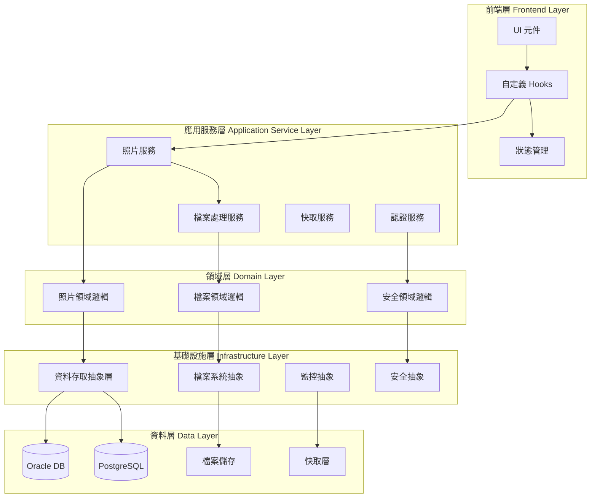
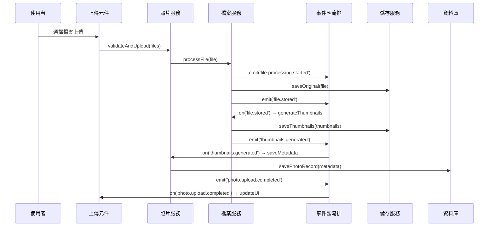
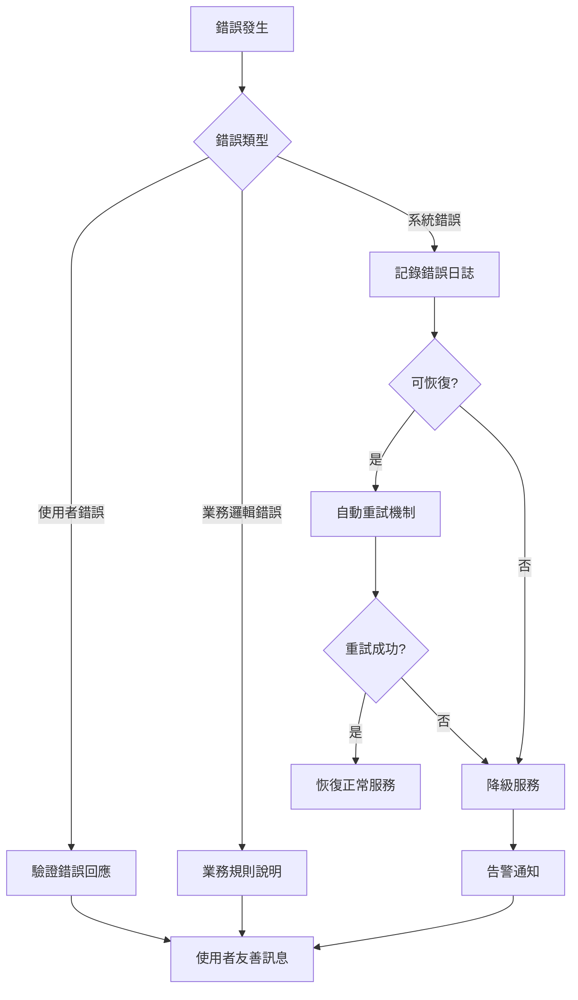
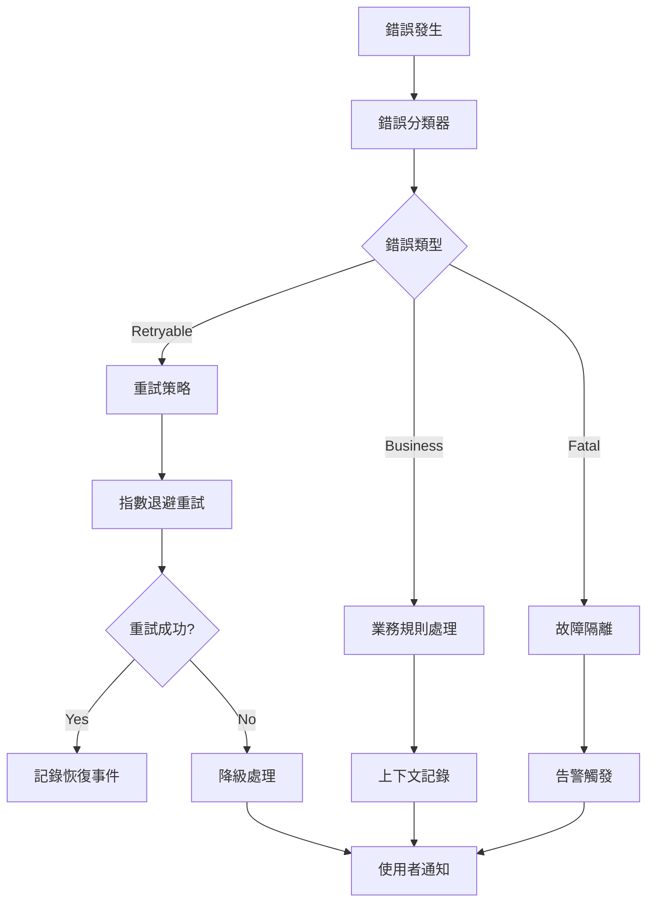
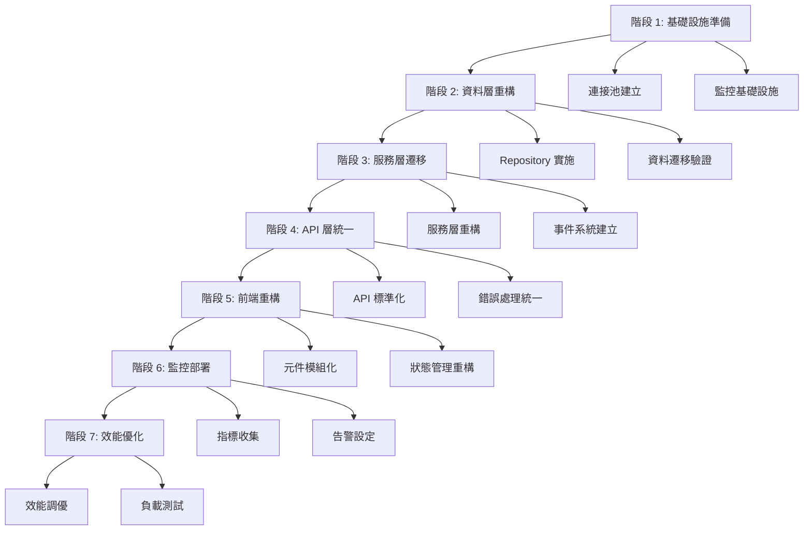

# 技術設計文件

## 概述

**目的**: iPhoto 架構改善專案旨在系統性重構現有工程照片庫的核心架構，解決資料庫連接不穩定、效能瓶頸、權限管理複雜性和可維護性問題，建立可擴展且穩定的照片管理系統。

**使用者**: 系統架構師、開發人員、維運人員將通過此架構改善獲得更穩定的開發環境、更清晰的程式碼結構和更可靠的系統運行。

**影響**: 此改善將重構現有 iPhoto 系統的所有架構層次，從資料存取層到使用者介面層，同時保持現有功能完整性並顯著提升系統穩定性、效能和可維護性。

### 目標
- 建立穩定且高效的資料存取層抽象
- 實施清晰的服務層架構分離關注點
- 統一 API 層設計和錯誤處理機制
- 重構狀態管理以支援複雜的非同步操作
- 模組化元件架構提升可重用性
- 優化檔案處理流程和效能
- 強化安全性和權限控制機制
- 建立全面的監控和可觀測性

### 非目標
- 不改變現有的使用者介面設計語言
- 不影響現有的專案權限模型核心邏輯
- 暫不整合新的第三方儲存服務
- 不包含新的檔案格式支援

## 架構

### 現有架構分析

**目前架構模式和限制**:
- **資料層問題**: Oracle/PostgreSQL 雙資料庫支援導致連接不穩定，缺乏統一抽象層
- **服務層耦合**: 業務邏輯散布在 API 路由中，缺乏清晰的服務邊界
- **API 層不一致**: 錯誤處理和回應格式不統一，缺乏結構化日誌
- **狀態管理債務**: Zustand 使用模式不一致，快取策略不明確
- **元件緊耦合**: 部分元件直接調用 API，測試困難

**必須保持的整合點**:
- Next.js 15 App Router 路由結構
- 現有的 JWT 認證機制
- shadcn/ui 元件系統
- 專案為基礎的權限模型

**需要解決的技術債務**:
- 資料庫連接池管理不當
- 缺乏服務層事務管理
- 檔案處理缺乏背景作業機制
- 錯誤監控和追蹤不完整

### 高層架構



### 技術對齊

**與現有技術棧的整合**:
- 保持 Next.js 15 App Router 和 TypeScript 嚴格類型檢查
- 維持 Zustand 狀態管理但重構為清晰的狀態分片
- 繼續使用 shadcn/ui 但加強元件合成模式
- 保留現有認證機制但加強安全層抽象

**新增架構抽象**:
- 引入 Repository Pattern 統一資料存取
- 實施 Service Layer Pattern 分離業務邏輯
- 加入 Domain-Driven Design 概念改善領域建模
- 使用 Dependency Injection 模式提升可測試性

### 關鍵設計決策

**決策 1: 資料存取層統一抽象**
- **決策**: 實施 Repository Pattern 和 Unit of Work Pattern 統一 Oracle/PostgreSQL 存取
- **背景**: 目前雙資料庫支援導致連接不穩定和程式碼重複
- **替代方案**: 選擇單一資料庫、使用 ORM 抽象、建立自定義抽象層
- **選擇方案**: 自定義抽象層結合連接池管理，支援透明的資料庫切換
- **理由**: 提供最大彈性同時解決連接穩定性問題，避免 ORM 過度抽象
- **權衡**: 增加抽象層複雜度，但獲得穩定性和維護性

**決策 2: 服務層架構重構**
- **決策**: 實施分層服務架構，分離應用服務、領域服務和基礎設施服務
- **背景**: 目前業務邏輯散布在 API 路由中，難以測試和維護
- **替代方案**: 保持現狀、使用單層服務、採用 Clean Architecture
- **選擇方案**: 三層服務架構結合依賴注入
- **理由**: 平衡複雜度和清晰度，提升程式碼可測試性和可維護性
- **權衡**: 初期重構成本較高，但長期維護效益顯著

**決策 3: 事件驅動架構導入**
- **決策**: 在檔案處理和狀態同步中引入事件驅動機制
- **背景**: 照片上傳、處理、儲存需要協調多個服務，目前同步處理影響效能
- **替代方案**: 保持同步處理、使用訊息佇列、實施事件匯流排
- **選擇方案**: 輕量級事件匯流排結合非同步處理
- **理由**: 改善使用者體驗，提升系統吞吐量，支援複雜業務流程
- **權衡**: 增加系統複雜度，但獲得更好的擴展性和效能

## 系統流程

### 照片上傳處理流程



### 錯誤處理和恢復流程



## 需求追蹤性

| 需求 | 需求摘要 | 實現元件 | 介面 | 流程 |
|------|----------|----------|------|------|
| 1.1-1.6 | 資料存取層重構 | DatabaseAbstraction, ConnectionPoolManager | IRepository, IUnitOfWork | DB連接管理流程 |
| 2.1-2.6 | 服務層架構優化 | PhotoService, FileProcessingService | IPhotoService, IFileService | 照片處理流程 |
| 3.1-3.6 | API層統一化設計 | ApiResponseBuilder, ErrorHandler | StandardApiResponse | API錯誤處理流程 |
| 4.1-4.6 | 狀態管理重構 | PhotoStore, CacheManager | IStateManager | 狀態同步流程 |
| 5.1-5.6 | 元件架構模組化 | ComponentSystem, ErrorBoundary | IComponent, IComposable | 元件生命週期 |
| 6.1-6.6 | 檔案處理流程優化 | FileProcessor, ThumbnailGenerator | IFileProcessor | 檔案處理流程 |
| 7.1-7.6 | 安全性架構強化 | SecurityManager, AccessControl | ISecurityPolicy | 安全驗證流程 |
| 8.1-8.6 | 監控與可觀測性 | MetricsCollector, AlertManager | IMonitoring | 監控告警流程 |

## 元件和介面

### 資料存取層

#### DatabaseAbstraction

**責任與邊界**
- **主要責任**: 提供統一的資料庫存取介面，抽象化 Oracle 和 PostgreSQL 差異
- **領域邊界**: 基礎設施層，負責所有資料持久化操作
- **資料擁有權**: 管理資料庫連接、查詢執行和事務管理
- **事務邊界**: 支援跨多個 Repository 的事務一致性

**依賴關係**
- **入站**: PhotoRepository, AlbumRepository, UserRepository
- **出站**: Oracle Driver, PostgreSQL Driver, ConnectionPoolManager
- **外部**: Oracle Database, PostgreSQL Database

**合約定義**

```typescript
interface IRepository<T> {
  findById(id: string): Promise<T | null>;
  findMany(criteria: SearchCriteria): Promise<PaginatedResult<T>>;
  create(entity: T): Promise<T>;
  update(id: string, updates: Partial<T>): Promise<T>;
  delete(id: string): Promise<void>;
}

interface IUnitOfWork {
  begin(): Promise<void>;
  commit(): Promise<void>;
  rollback(): Promise<void>;
  getRepository<T>(type: RepositoryType<T>): IRepository<T>;
}

interface ConnectionPoolManager {
  getConnection(database: 'oracle' | 'postgresql'): Promise<DatabaseConnection>;
  healthCheck(): Promise<HealthStatus>;
  releaseConnection(connection: DatabaseConnection): Promise<void>;
}
```

**前置條件**: 資料庫連接必須已建立且可用
**後置條件**: 保證資料一致性，所有操作具備 ACID 特性
**不變條件**: 連接池狀態始終有效，事務狀態明確

#### ConnectionPoolManager

**責任與邊界**
- **主要責任**: 管理資料庫連接池，提供連接生命週期管理
- **領域邊界**: 基礎設施層，專責連接管理
- **資料擁有權**: 連接池狀態、連接統計和健康監控
- **事務邊界**: 單一連接的生命週期管理

**整合策略**: 重構現有 connection.ts，保持向後相容的 API 介面，增加連接池監控

### 應用服務層

#### PhotoService

**責任與邊界**
- **主要責任**: 協調照片相關的業務流程，整合多個領域服務
- **領域邊界**: 應用服務層，照片管理業務邏輯
- **資料擁有權**: 照片業務流程狀態，不直接擁有持久化資料
- **事務邊界**: 跨多個領域服務的業務事務

**依賴關係**
- **入站**: PhotoController, PhotoHooks
- **出站**: PhotoDomainService, FileProcessingService, SecurityService
- **外部**: EventBus, CacheService

**合約定義**

```typescript
interface IPhotoService {
  uploadPhotos(files: File[], projectId: string): Promise<Result<PhotoUploadResult[], PhotoError>>;
  getPhotos(projectId: string, filters: PhotoFilters): Promise<Result<Photo[], PhotoError>>;
  deletePhoto(photoId: string): Promise<Result<void, PhotoError>>;
  updatePhotoMetadata(photoId: string, metadata: PhotoMetadata): Promise<Result<Photo, PhotoError>>;
}

type PhotoUploadResult = {
  id: string;
  status: 'success' | 'processing' | 'failed';
  thumbnailUrl?: string;
  processingProgress?: number;
}

type PhotoError =
  | { type: 'validation'; message: string; field?: string }
  | { type: 'permission'; message: string }
  | { type: 'storage'; message: string; retryable: boolean }
  | { type: 'processing'; message: string; retryable: boolean };
```

**事件合約**:
- **發布事件**: `photo.upload.started`, `photo.upload.completed`, `photo.deleted`
- **訂閱事件**: `file.processing.completed`, `thumbnail.generated`
- **排序要求**: 照片事件按時間戳排序
- **交付保證**: 至少一次交付，支援冪等處理

**整合策略**: 重構現有 PhotoService，將 API 直接呼叫邏輯移至此服務層，保持原有的公開介面

#### FileProcessingService

**責任與邊界**
- **主要責任**: 處理檔案上傳、壓縮、格式轉換和縮圖生成
- **領域邊界**: 應用服務層，檔案處理業務邏輯
- **資料擁有權**: 檔案處理狀態和進度追蹤
- **事務邊界**: 單一檔案的完整處理流程

**批次作業合約**:
- **觸發條件**: 檔案上傳事件或排程觸發
- **輸入**: 原始檔案資料和處理參數
- **輸出**: 處理後的檔案和縮圖
- **冪等性**: 相同輸入產生相同輸出，支援重複執行
- **恢復策略**: 失敗時自動重試最多 3 次，記錄錯誤詳情

### 使用者介面層

#### PhotoStore (Zustand)

**責任與邊界**
- **主要責任**: 管理照片相關的前端狀態，提供響應式資料流
- **領域邊界**: 前端狀態層，照片 UI 狀態管理
- **資料擁有權**: 照片列表、選擇狀態、過濾條件、載入狀態
- **事務邊界**: 前端狀態的一致性管理

**狀態管理**:
- **狀態模型**: `idle` → `loading` → `success/error` → `idle`
- **持久化策略**: 使用者偏好設定持久化到 localStorage
- **並發控制**: 樂觀更新結合衝突解決機制

**整合策略**: 重構現有 photoStore.ts，實施狀態分片和智慧快取策略

#### PhotoGrid Component

**責任與邊界**
- **主要責任**: 渲染照片網格，支援虛擬滾動和懶載入
- **領域邊界**: UI 元件層，純展示邏輯
- **資料擁有權**: 元件內部的 UI 狀態（滾動位置、選擇狀態）
- **事務邊界**: 單一元件的渲染週期

**依賴注入模式**: 接受 PhotoService 作為屬性，提升可測試性

```typescript
interface PhotoGridProps {
  photoService: IPhotoService;
  photos: Photo[];
  onPhotoSelect: (photo: Photo) => void;
  loading?: boolean;
  error?: PhotoError;
}
```

**整合策略**: 重構現有 PhotoGrid.tsx，移除直接 API 呼叫，改用依賴注入

## 資料模型

### 領域模型

**核心概念**:
- **照片聚合 (Photo Aggregate)**: 包含照片實體、檔案資訊和 metadata，維護照片的完整性
- **相簿聚合 (Album Aggregate)**: 管理照片分組和權限，確保相簿一致性
- **專案聚合 (Project Aggregate)**: 控制專案範圍的資源存取

**業務規則與不變條件**:
- 照片必須屬於有效的相簿和專案
- 使用者只能存取其有權限的專案照片
- 檔案處理狀態必須與資料庫記錄保持一致
- 照片刪除採用軟刪除，保留稽核記錄

### 實體資料模型

**照片資料結構**:
```typescript
interface PhotoEntity {
  id: string;
  projectId: string;
  albumId: string;
  originalFileName: string;
  fileSize: number;
  mimeType: string;
  checksum: string;
  uploadedBy: string;
  uploadedAt: Date;
  metadata: PhotoMetadata;
  processingStatus: ProcessingStatus;
  deletedAt?: Date;
}

interface PhotoMetadata {
  width: number;
  height: number;
  capturedAt?: Date;
  cameraModel?: string;
  location?: GeoLocation;
  thumbnails: ThumbnailInfo[];
}
```

**參照完整性規則**:
- 照片必須參照有效的專案和相簿
- 檔案刪除時保留 metadata 用於稽核
- 使用者刪除時照片標記為孤立狀態

### 資料合約與整合

**API 資料傳輸**:
```typescript
interface PhotoUploadRequest {
  files: FileData[];
  albumId: string;
  metadata?: Partial<PhotoMetadata>;
}

interface PhotoListResponse {
  photos: PhotoSummary[];
  pagination: PaginationInfo;
  filters: AppliedFilters;
}

interface ApiResponse<T> {
  success: boolean;
  data?: T;
  error?: ApiError;
  meta: ResponseMeta;
}
```

**事件架構**:
- **事件版本控制**: 使用語意版本控制，支援向後相容
- **向前/向後相容**: 新欄位為可選，舊欄位漸進式淘汰
- **架構演進策略**: 支援 3 個版本的平行運行

## 錯誤處理

### 錯誤策略

**分層錯誤處理機制**:
- **基礎設施層**: 連接錯誤、IO 錯誤，自動重試和熔斷
- **領域層**: 業務規則違反，記錄詳細上下文
- **應用層**: 流程錯誤，提供恢復建議
- **UI 層**: 使用者友善訊息，引導操作

### 錯誤分類與回應

**使用者錯誤 (4xx)**:
- 無效輸入 → 欄位級驗證回饋，即時驗證
- 未授權存取 → 認證指引，重定向登入
- 資源不存在 → 導航協助，相關建議

**系統錯誤 (5xx)**:
- 基礎設施故障 → 優雅降級，快取回退
- 逾時錯誤 → 熔斷機制，自動重試
- 資源耗盡 → 速率限制，佇列管理

**業務邏輯錯誤 (422)**:
- 規則違反 → 條件說明，替代方案
- 狀態衝突 → 轉換指引，狀態修復

### 錯誤處理流程



### 監控

**錯誤追蹤**: 結構化日誌記錄，包含追蹤 ID、使用者上下文、錯誤堆疊
**日誌策略**: 分級日誌記錄，敏感資訊遮罩，日誌聚合分析
**健康監控**: 端點健康檢查，服務相依性監控，效能指標收集

## 測試策略

### 單元測試
- **服務層邏輯**: PhotoService, FileProcessingService 的業務邏輯驗證
- **領域模型**: Photo, Album 實體的業務規則測試
- **工具函數**: 檔案處理、驗證邏輯的單元測試
- **錯誤處理**: 各類錯誤情境的處理邏輯驗證
- **狀態管理**: Zustand store 的狀態變更邏輯測試

### 整合測試
- **資料存取層**: Repository 與實際資料庫的整合測試
- **檔案處理流程**: 上傳、壓縮、縮圖生成的端到端流程
- **事件處理**: 事件發布和訂閱的整合驗證
- **API 層**: 控制器與服務層的整合測試
- **快取機制**: 快取策略和失效機制的驗證

### E2E/UI 測試
- **照片上傳流程**: 完整的檔案上傳和處理流程
- **照片瀏覽體驗**: 網格檢視、篩選、搜尋功能
- **權限控制**: 不同角色的存取權限驗證
- **錯誤恢復**: 網路中斷、檔案損壞等異常情境
- **效能測試**: 大量照片載入的效能表現

### 效能/負載測試
- **並發上傳**: 多使用者同時上傳的系統表現
- **大量資料**: 數千張照片的載入和篩選效能
- **記憶體使用**: 長期運行的記憶體洩漏檢測
- **資料庫效能**: 高負載下的查詢效能和連接池表現

## 安全性考慮

### 威脅建模

**攻擊向量分析**:
- 檔案上傳攻擊：惡意檔案注入、檔案類型欺騙
- 權限提升：橫向存取其他專案資料
- 資料洩露：敏感照片的未授權存取
- 拒絕服務：大檔案上傳耗盡系統資源

**安全控制機制**:
- 檔案類型白名單驗證
- 檔案內容深度掃描
- 基於角色的細粒度權限控制
- 資源使用配額和速率限制

### 認證與授權模式

**多層認證架構**:
- JWT Token 驗證保持無狀態
- 細粒度資源權限控制
- 會話管理和逾時控制
- API 金鑰管理用於服務間通訊

**權限控制策略**:
```typescript
interface SecurityPolicy {
  canUploadPhotos(userId: string, projectId: string): Promise<boolean>;
  canViewPhoto(userId: string, photoId: string): Promise<boolean>;
  canDeletePhoto(userId: string, photoId: string): Promise<boolean>;
  getAccessibleProjects(userId: string): Promise<string[]>;
}
```

### 資料保護與隱私

**資料加密策略**:
- 傳輸中資料使用 TLS 1.3 加密
- 靜態敏感資料使用 AES-256 加密
- 金鑰管理使用專用的金鑰管理服務
- 定期金鑰輪換和稽核機制

**隱私保護措施**:
- 照片 EXIF 資料的敏感資訊過濾
- 個人識別資訊的遮罩處理
- 資料存取日誌和稽核追蹤
- 符合資料保護法規的資料保留政策

## 效能與擴展性

### 目標指標與測量策略

**效能目標**:
- API 回應時間 < 500ms (95th percentile)
- 照片載入時間 < 2 秒 (首屏)
- 檔案上傳處理時間 < 30 秒 (10MB 檔案)
- 系統可用性 > 99.5%

**測量與監控**:
- Real User Monitoring (RUM) 收集真實使用者體驗數據
- Application Performance Monitoring (APM) 追蹤後端效能
- 自定義業務指標追蹤關鍵操作時間
- 錯誤率和成功率的即時監控

### 擴展方法

**水平擴展策略**:
- API 服務無狀態設計，支援負載平衡
- 檔案處理服務使用佇列機制，支援多工作者節點
- 資料庫讀取複本分離讀寫負載
- CDN 分發靜態檔案和縮圖

**垂直擴展優化**:
- 資料庫連接池調優
- 記憶體快取策略優化
- CPU 密集型操作的非同步處理
- I/O 操作的批次處理優化

### 快取策略與優化

**多層快取架構**:
- 瀏覽器快取：靜態資源和縮圖
- CDN 快取：全球分散式內容快取
- 應用快取：熱點資料的記憶體快取
- 資料庫快取：查詢結果快取

**快取失效策略**:
- 基於時間的 TTL 快取失效
- 基於事件的主動快取失效
- 智慧預取熱點資料
- 快取穿透和快取雪崩防護

## 遷移策略

### 遷移階段規劃



### 程序細節

**階段 1-2 (週 1-2): 基礎架構建立**
- 建立新的 DatabaseAbstraction 和 ConnectionPoolManager
- 實施基本的 Repository Pattern
- 部署監控基礎設施
- 驗證資料存取層穩定性

**階段 3-4 (週 3-4): 服務層重構**
- 重構 PhotoService 和 FileProcessingService
- 實施事件驅動架構
- 統一 API 回應格式
- 部署新的錯誤處理機制

**階段 5-6 (週 5-6): 前端優化**
- 重構前端元件和狀態管理
- 實施新的快取策略
- 部署監控和告警系統
- 進行整合測試

**階段 7 (週 7): 最終優化**
- 效能調優和負載測試
- 安全性稽核和漏洞修復
- 使用者接受度測試
- 文件更新和維護指南

### 回滾觸發條件

**自動回滾條件**:
- 系統可用性低於 95%
- API 錯誤率超過 5%
- 資料庫連接失敗率超過 10%
- 記憶體使用量超過 90%

**手動回滾條件**:
- 使用者回報的嚴重功能缺陷
- 資料完整性問題
- 安全性漏洞發現
- 效能嚴重退化

### 驗證檢查點

**資料完整性驗證**:
- 照片數量和檔案大小統計比對
- 權限設定和存取控制驗證
- metadata 一致性檢查
- 備份和恢復程序測試

**功能完整性驗證**:
- 核心使用者流程端到端測試
- API 相容性測試
- 效能基準測試
- 安全性掃描和滲透測試