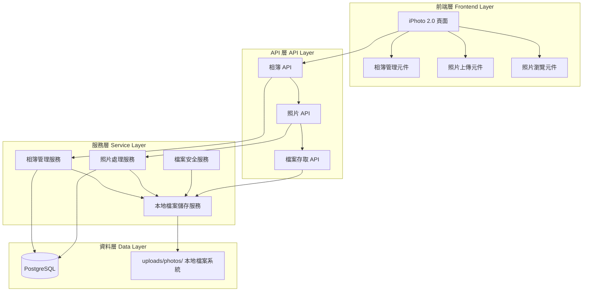
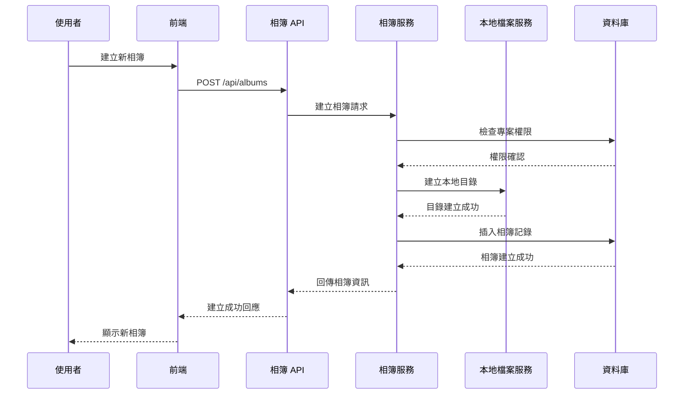
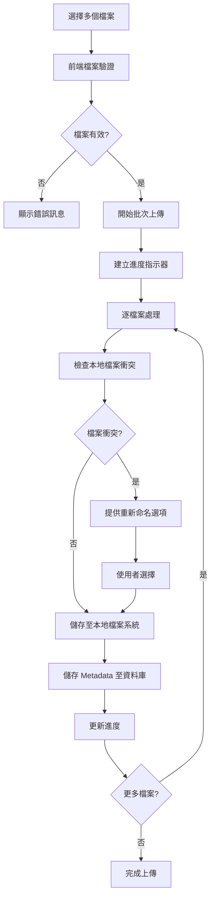
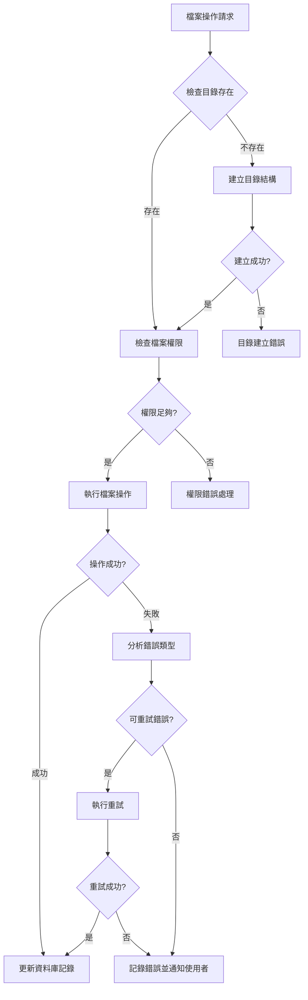
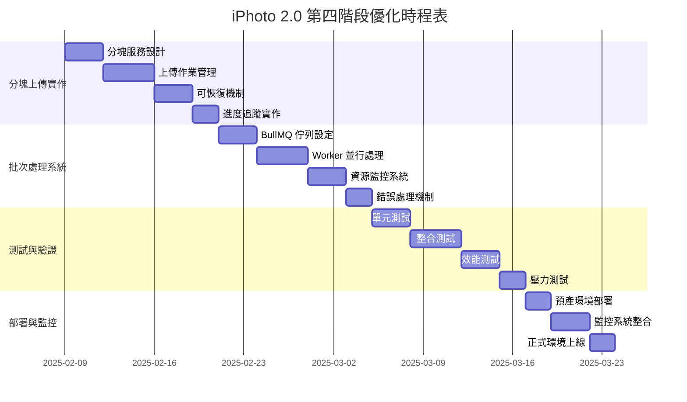

# 技術設計文件

## 概述

iPhoto
2.0 增強模組為現有 PCM 平台建立全面的專案照片管理系統，使用本地檔案系統儲存、現代化 shadcn/ui 介面，以及完整的相簿和照片 CRUD 操作。此模組擴展現有的照片管理功能，提供工程團隊集中式的照片資料管理和存取能力。

**目標使用者**: 專案經理、工程師、承包商需要上傳、組織和管理工程相關照片的團隊成員。

**影響範圍**: 擴展現有照片管理系統，使用專案目錄內的本地檔案儲存 (uploads/photos/)，增強使用者介面和相簿管理功能，並在「溝通管理」模組下新增 iphoto2.0 功能入口。

### 目標

- 提供專案級別的相簿管理系統，支援相簿 CRUD 操作
- 使用本地專案目錄 (uploads/photos/) 作為檔案儲存後端
- 實現拖拽式批次照片上傳和管理功能
- 建立現代化響應式使用者介面使用 shadcn/ui 元件
- 提供完整的照片 metadata 管理和搜尋功能

### 非目標

- 重寫現有的照片管理核心邏輯
- 實作進階影像編輯功能
- 建立分散式檔案儲存服務
- 效能優化和安全性強化 (後續階段處理)

## 架構

### 現有架構分析

目前系統已具備完整的照片管理基礎架構：

- **資料庫層**: PostgreSQL 完整的照片管理 schema (photo_albums, photos, photo_versions)
- **API 層**: RESTful 端點支援專案照片操作 (/api/projects/[projectId]/photos, /api/photos/[id])
- **服務層**: EnhancedPhotoService、FileProcessingService、事件匯流排
- **前端元件**: PhotoGalleryList、PhotoUploader、PhotoLightbox 等完整元件庫
- **安全層**: FileSecurityService 提供檔案驗證、配額管理
- **檔案系統**: 現有基礎的檔案上傳和儲存機制

此設計將保持現有架構模式，重點擴展本地檔案儲存管理和使用者介面增強。

### 高層架構



### 技術對齊

**現有技術棧整合**:

- Next.js App Router 架構維持不變
- 使用現有的 shadcn/ui 元件系統進行 UI 擴展
- 整合現有的 DatabaseConnection 和 Repository 模式
- 延續現有的事件驅動架構和錯誤處理模式
- 擴展現有的 FileSecurityService 檔案安全驗證機制

**新增依賴項**:

- Node.js `fs/promises` 模組用於本地檔案操作
- `path` 模組用於路徑管理和目錄結構建立
- `mkdir` 遞迴目錄建立功能

**架構模式維持**:

- 現有的分層架構和關注點分離
- Repository Pattern 和 Unit of Work 模式
- 事件驅動的服務協作
- 統一的 API 回應格式

## 關鍵設計決策

### 決策 1: 本地檔案儲存策略

**決策**: 使用專案目錄內的本地檔案系統儲存 (uploads/photos/)

**情境**: 需要為照片管理系統提供穩定、高效的檔案儲存方案，避免外部網路依賴

**替代方案**:

- 外部 NFS 網路儲存系統
- 雲端物件儲存服務 (S3, Azure Blob)
- 資料庫 BLOB 儲存
- 專用檔案伺服器

**選擇方法**: 本地檔案系統 + 專案目錄結構管理

**理由**:

- 消除網路延遲和連線穩定性問題
- 簡化部署和維護複雜度，無需額外基礎設施
- 與現有 Node.js 檔案處理邏輯完全相容
- 提供最佳的讀寫效能和可靠性
- 支援標準檔案系統權限和備份機制

**權衡**:

- 獲得: 高效能、高可靠性、部署簡化、維護便利
- 犧牲: 單機儲存限制、水平擴展需額外規劃

### 決策 2: 目錄結構組織策略

**決策**: 採用「uploads/photos/專案代碼/相簿名稱」階層式目錄結構

**情境**: 需要在本地檔案系統中建立有組織的目錄結構，支援多專案和多相簿管理

**替代方案**:

- 平面檔案結構使用 UUID 命名
- 單一目錄存放所有檔案
- 基於日期時間的目錄結構
- 使用者自定義目錄結構

**選擇方法**: 階層式自動目錄建立，使用專案代碼和相簿名稱

**理由**:

- 符合使用者直觀的檔案組織習慣
- 支援檔案系統層級的瀏覽和管理
- 便於備份和維護作業
- 與現有專案管理系統自然整合
- 提供清晰的資料隔離和存取控制

**權衡**:

- 獲得: 直觀性、可維護性、資料組織清晰
- 犧牲: 目錄名稱變更的複雜度、檔案路徑長度

### 決策 3: 檔案衝突解決機制

**決策**: 智慧重新命名 + 使用者確認策略

**情境**: 當上傳檔案名稱在目標目錄中已存在時的處理策略

**替代方案**:

- 自動覆蓋現有檔案
- 直接拒絕重複檔案上傳
- 總是自動附加時間戳或序號
- 使用 UUID 重新命名所有檔案

**選擇方法**: 檢測衝突 → 提供智慧重新命名建議 → 使用者確認操作

**理由**:

- 防止意外的檔案覆蓋和資料遺失
- 保持檔案名稱的語義性和使用者意圖
- 提供使用者控制權和透明度
- 支援批次上傳時的靈活處理

**權衡**:

- 獲得: 資料安全性、使用者控制、檔案意義保持
- 犧牲: 上傳流程複雜度、需要使用者互動

## 系統流程

### 相簿建立流程



### 照片批次上傳流程



## 需求追蹤性

| 需求    | 需求摘要           | 主要元件                         | 介面               | 相關流程               |
| ------- | ------------------ | -------------------------------- | ------------------ | ---------------------- |
| 1.1-1.6 | 專案相簿管理系統   | AlbumManagementService, AlbumAPI | /api/albums/\*     | 相簿建立流程           |
| 2.1-2.6 | 照片上傳與管理     | PhotoUploadService, PhotoAPI     | /api/photos/\*     | 照片批次上傳流程       |
| 3.1-3.6 | 本地檔案儲存整合   | LocalFileStorageService          | 本地檔案操作介面   | 目錄建立、檔案存取流程 |
| 4.1-4.6 | 前端介面增強       | iPhoto2Components                | React 元件介面     | 使用者互動流程         |
| 5.1-5.6 | API 層設計         | 統一 API 回應格式                | RESTful 端點       | API 錯誤處理流程       |
| 6.1-6.6 | 照片 Metadata 管理 | MetadataService                  | Metadata CRUD 介面 | EXIF 提取、搜尋流程    |

## 元件與介面

### 儲存管理層

#### LocalFileStorageService

**責任與邊界**

- **主要責任**: 管理本地檔案系統的檔案操作，包括目錄建立、檔案上傳、下載和刪除
- **領域邊界**: 檔案系統存取層，專責本地檔案儲存操作
- **資料擁有權**: 本地目錄結構管理、檔案路徑解析、檔案權限控制
- **事務邊界**: 單一檔案操作的原子性

**依賴關係**

- **入站**: AlbumManagementService, PhotoUploadService 需要檔案儲存服務
- **出站**: Node.js fs/promises 模組，本地檔案系統
- **外部**: uploads/photos/ 本地目錄結構

**服務介面**

```typescript
interface LocalFileStorageService {
  createAlbumDirectory(
    projectCode: string,
    albumName: string
  ): Promise<Result<DirectoryInfo, StorageError>>;
  uploadFile(
    projectCode: string,
    albumName: string,
    file: File,
    options?: UploadOptions
  ): Promise<Result<FileInfo, StorageError>>;
  deleteFile(filePath: string): Promise<Result<void, StorageError>>;
  checkFileExists(filePath: string): Promise<Result<boolean, StorageError>>;
  resolveFileConflict(
    filePath: string,
    strategy: ConflictResolution
  ): Promise<Result<string, StorageError>>;
  getStorageQuota(): Promise<Result<StorageQuota, StorageError>>;
  ensureDirectoryExists(directoryPath: string): Promise<Result<void, StorageError>>;
  getDirectoryListing(directoryPath: string): Promise<Result<FileInfo[], StorageError>>;
}
```

**前置條件**: uploads/photos/ 目錄存在且具有適當的檔案系統權限
**後置條件**: 檔案操作完成且本地目錄結構與資料庫記錄同步
**不變條件**: 目錄結構始終遵循「uploads/photos/專案代碼/相簿名稱」格式

### 業務邏輯層

#### AlbumManagementService

**責任與邊界**

- **主要責任**: 管理專案相簿的生命週期，包括建立、修改、刪除和權限控制
- **領域邊界**: 相簿領域邏輯，與專案管理系統整合
- **資料擁有權**: 相簿 metadata、相簿權限、相簿與專案關聯
- **事務邊界**: 相簿操作與對應的本地目錄操作的一致性

**依賴關係**

- **入站**: AlbumAPI 呼叫業務邏輯
- **出站**: LocalFileStorageService (目錄操作)、DatabaseRepository (metadata 儲存)
- **外部**: 專案管理系統的權限驗證服務

**服務介面**

```typescript
interface AlbumManagementService {
  createAlbum(request: CreateAlbumRequest): Promise<Result<Album, BusinessError>>;
  updateAlbum(albumId: string, updates: AlbumUpdates): Promise<Result<Album, BusinessError>>;
  deleteAlbum(albumId: string, userId: string): Promise<Result<void, BusinessError>>;
  getProjectAlbums(projectId: string, userId: string): Promise<Result<Album[], BusinessError>>;
  validateAlbumAccess(
    albumId: string,
    userId: string,
    action: AccessAction
  ): Promise<Result<boolean, BusinessError>>;
}
```

**整合策略**: 擴展現有 EnhancedPhotoService，新增相簿管理功能而非建立獨立服務
**向後相容性**: 維持現有的照片 API 端點和資料格式
**遷移路徑**: 逐步將現有照片功能整合到新的相簿架構中

#### PhotoUploadService

**責任與邊界**

- **主要責任**: 處理照片上傳業務流程，包括檔案驗證、衝突處理、批次上傳和 metadata 提取
- **領域邊界**: 照片上傳和處理領域
- **資料擁有權**: 照片 metadata、上傳狀態、檔案處理結果
- **事務邊界**: 照片檔案儲存與 metadata 記錄的一致性

**依賴關係**

- **入站**: PhotoAPI 的上傳請求
- **出站**: LocalFileStorageService (檔案儲存)、FileSecurityService (安全驗證)、MetadataService
  (EXIF 處理)
- **外部**: 現有的 FileProcessingService 進行影像處理

**服務介面**

```typescript
interface PhotoUploadService {
  uploadSinglePhoto(request: PhotoUploadRequest): Promise<Result<Photo, UploadError>>;
  uploadBatchPhotos(request: BatchUploadRequest): Promise<Result<BatchUploadResult, UploadError>>;
  handleFileConflict(conflict: FileConflict): Promise<Result<ConflictResolution, UploadError>>;
  validateUploadPermission(albumId: string, userId: string): Promise<Result<boolean, AuthError>>;
  processPhotoMetadata(file: File): Promise<Result<PhotoMetadata, ProcessingError>>;
}
```

**整合策略**: 整合現有 EnhancedPhotoService 的檔案處理能力，新增 NFS 儲存邏輯

### API 層

#### AlbumAPI

**API 合約** | 方法 | 端點 | 請求 | 回應 | 錯誤 | |------|------|------|------|------| | GET |
/api/projects/[projectId]/albums | ProjectAlbumsQuery | Album[] | 404, 403, 500 | | POST |
/api/albums | CreateAlbumRequest | Album | 400, 403, 409, 500 | | PUT | /api/albums/[id] |
UpdateAlbumRequest | Album | 400, 403, 404, 500 | | DELETE | /api/albums/[id] | - | DeleteResult |
403, 404, 409, 500 |

**請求/回應 Schema**:

```typescript
interface CreateAlbumRequest {
  projectId: string;
  name: string;
  description?: string;
  tags?: string[];
}

interface Album {
  id: string;
  projectId: string;
  name: string;
  description?: string;
  photoCount: number;
  coverPhotoUrl?: string;
  createdAt: Date;
  updatedAt: Date;
  tags: string[];
}
```

#### PhotoAPI (擴展現有)

**擴展現有端點**:

- 現有: `/api/projects/[projectId]/photos` - 保持相容性
- 新增: `/api/albums/[albumId]/photos` - 相簿特定照片操作
- 擴展: 支援批次上傳和檔案衝突處理

## 資料模型

### 邏輯資料模型

**現有 Schema 擴展**: 現有的 photo_albums 和 photos 表格已提供完整的資料結構。此設計將擴展現有 schema 而非重建：

**相簿模型擴展**:

```sql
-- 擴展現有 photo_albums 表格
ALTER TABLE photo_albums ADD COLUMN IF NOT EXISTS tags JSONB DEFAULT '[]'::jsonb;
ALTER TABLE photo_albums ADD COLUMN IF NOT EXISTS nfs_path TEXT;

-- 新增索引支援標籤搜尋
CREATE INDEX IF NOT EXISTS idx_albums_tags_gin ON photo_albums USING GIN (tags);
```

**照片模型擴展**:

```sql
-- 擴展現有 photos 表格
ALTER TABLE photos ADD COLUMN IF NOT EXISTS nfs_file_path TEXT;
ALTER TABLE photos ADD COLUMN IF NOT EXISTS conflict_resolution TEXT CHECK (conflict_resolution IN ('rename', 'overwrite', 'skip'));

-- 更新 metadata 欄位結構以支援更豐富的 EXIF 資料
-- metadata JSONB 欄位將包含:
-- {
--   "exif": { "camera": "", "lens": "", "settings": {} },
--   "gps": { "latitude": "", "longitude": "", "altitude": "" },
--   "technical": { "colorSpace": "", "orientation": "" }
-- }
```

### 本地檔案結構

**目錄組織**:

```
uploads/photos/
├── [專案代碼1]/
│   ├── [相簿名稱1]/
│   │   ├── photo1.jpg
│   │   └── photo2.png
│   └── [相簿名稱2]/
└── [專案代碼2]/
    └── [相簿名稱1]/
```

**檔案命名策略**:

- 保持原檔名以維持使用者識別性
- 衝突時附加時間戳或序號：`photo.jpg` → `photo_1632847200.jpg`
- 特殊字符替換確保跨平台相容性
- 使用安全的檔案路徑避免路徑遍歷攻擊

### 資料一致性

**資料庫與檔案系統同步**:

- 使用事務確保資料庫記錄與檔案操作的原子性
- 實作補償性事務處理檔案操作失敗情況
- 建立定期同步檢查機制識別並修復不一致狀態
- 實作檔案權限檢查確保安全存取

## 錯誤處理

### 錯誤分類與處理策略

**檔案系統錯誤** (基礎設施層)

- **錯誤類型**: 磁碟空間不足、檔案權限拒絕、I/O 錯誤
- **處理策略**: 即時錯誤報告 → 空間清理建議 → 權限修復指引
- **使用者體驗**: 顯示具體錯誤原因和解決方案

**檔案衝突錯誤** (業務邏輯層)

- **錯誤類型**: 檔案名稱重複、目錄不存在、路徑過長
- **處理策略**: 提供重新命名選項 → 自動重試 → 使用者確認覆蓋
- **使用者體驗**: 互動式衝突解決對話框

**權限驗證錯誤** (應用層)

- **錯誤類型**: 無專案存取權、相簿檢視限制、上傳配額超限
- **處理策略**: 立即拒絕 → 提供權限申請連結 → 記錄稽核日誌
- **使用者體驗**: 明確的權限說明和申請指引

**資料驗證錯誤** (輸入層)

- **錯誤類型**: 檔案格式不支援、檔案過大、缺少必要欄位
- **處理策略**: 前端即時驗證 → 批次上傳中跳過無效檔案 → 提供詳細錯誤報告
- **使用者體驗**: 即時回饋和批次處理結果摘要

### 檔案操作錯誤處理流程



### 監控與恢復

**檔案系統健康檢查**:

- 定期檢查 uploads/photos/ 目錄的可用性和權限
- 監控磁碟使用率和剩餘空間
- 追蹤檔案操作成功率和響應時間
- 檢查目錄結構完整性

**資料恢復機制**:

- 實作檔案操作的補償性事務
- 建立孤兒檔案清理程序
- 提供資料庫與本地檔案系統的一致性檢查工具
- 實作自動目錄修復機制

## 測試策略

### 單元測試

- **LocalFileStorageService**: 檔案操作、目錄建立、錯誤處理、權限檢查
- **AlbumManagementService**: 相簿業務邏輯、權限驗證
- **PhotoUploadService**: 上傳流程、衝突處理、metadata 提取
- **API 控制器**: 請求驗證、回應格式、錯誤碼

### 整合測試

- **本地檔案系統整合**: 實際檔案操作、目錄同步、權限驗證
- **資料庫事務**: 檔案與資料庫操作的一致性
- **API 端點**: 完整請求-回應週期
- **權限系統**: 跨服務權限驗證

### 端到端測試 (Playwright)

- **相簿管理流程**: 建立 → 編輯 → 刪除相簿
- **照片上傳流程**: 單檔上傳 → 批次上傳 → 檔案衝突處理
- **照片瀏覽流程**: 相簿檢視 → 照片預覽 → 下載
- **響應式介面**: 桌面和行動裝置體驗
- **錯誤情境**: 檔案系統錯誤恢復、權限變更

### 檔案系統特定測試

- **磁碟空間限制**: 驗證空間不足的錯誤處理
- **檔案權限測試**: 驗證不同權限等級的檔案操作
- **並發檔案操作**: 多使用者同時上傳的衝突處理
- **大檔案上傳**: 驗證大容量檔案的上傳穩定性
- **目錄結構完整性**: 驗證目錄建立和清理機制

## 遷移策略

### 第四階段: 大檔案上傳和批次處理優化

此階段專注於提升系統在處理大容量檔案和批次操作時的效能和使用者體驗。

**核心目標**:

- 實作分塊上傳機制支援大檔案處理
- 建立高效率的批次處理佇列系統
- 提供即時進度追蹤和錯誤恢復能力
- 優化記憶體使用和處理效能

**技術重點**:

- 分塊上傳架構實作
- 並行處理控制和佇列管理
- 可恢復上傳機制
- 進度追蹤和使用者回饋

### 大檔案上傳優化詳細設計

#### 分塊上傳架構

**分塊策略**:

- **分塊大小**: 1MB (1024 \* 1024 bytes) 為標準分塊大小
- **並行上傳**: 支援同時 3-5 個分塊並行上傳提升速度
- **記憶體效率**: 使用 Node.js streams 避免將整個檔案載入記憶體
- **進度追蹤**: 即時計算上傳百分比和剩餘時間

**技術實作**:

```typescript
interface ChunkedUploadService {
  // 初始化上傳作業，獲取上傳 ID
  initializeUpload(file: FileMetadata): Promise<Result<UploadSession, UploadError>>;

  // 上傳單一分塊
  uploadChunk(
    uploadId: string,
    chunkNumber: number,
    chunkData: Buffer
  ): Promise<Result<ChunkResult, UploadError>>;

  // 完成上傳，合併所有分塊
  finalizeUpload(uploadId: string): Promise<Result<FileInfo, UploadError>>;

  // 可恢復上傳 - 獲取已上傳的分塊清單
  getUploadStatus(uploadId: string): Promise<Result<UploadStatus, UploadError>>;

  // 取消上傳，清理臨時檔案
  cancelUpload(uploadId: string): Promise<Result<void, UploadError>>;
}

interface UploadSession {
  uploadId: string;
  fileName: string;
  fileSize: number;
  totalChunks: number;
  chunkSize: number;
  expiresAt: Date;
}

interface ChunkResult {
  chunkNumber: number;
  checksum: string;
  uploadedAt: Date;
  isComplete: boolean;
}

interface UploadStatus {
  uploadId: string;
  completedChunks: number[];
  totalChunks: number;
  uploadedBytes: number;
  totalBytes: number;
  status: 'uploading' | 'paused' | 'completed' | 'failed';
}
```

#### 可恢復上傳機制

**實作原理**:

- **上傳狀態管理**: 在資料庫中記錄每個上傳作業的進度
- **分塊檢查點**: 使用 SHA-256 checksum 驗證分塊完整性
- **斷線重連**: 網路中斷後自動從最後一個成功的分塊繼續上傳
- **過期清理**: 自動清理超過 24 小時的未完成上傳

**錯誤處理策略**:

```typescript
class UploadRecoveryManager {
  // 重試策略: 指數退避 + 最大重試次數
  async retryChunkUpload(
    uploadId: string,
    chunkNumber: number,
    maxRetries: number = 3
  ): Promise<boolean> {
    for (let attempt = 1; attempt <= maxRetries; attempt++) {
      try {
        const delay = Math.pow(2, attempt) * 1000; // 2s, 4s, 8s
        await new Promise(resolve => setTimeout(resolve, delay));
        await this.uploadChunk(uploadId, chunkNumber);
        return true;
      } catch (error) {
        if (attempt === maxRetries) throw error;
      }
    }
    return false;
  }

  // 檢查和修復損壞的上傳作業
  async validateAndRepairUpload(uploadId: string): Promise<RepairResult> {
    const status = await this.getUploadStatus(uploadId);
    const missingChunks = this.findMissingChunks(status);
    const corruptedChunks = await this.verifyChunkIntegrity(uploadId);

    return {
      missingChunks,
      corruptedChunks,
      repairRequired: missingChunks.length > 0 || corruptedChunks.length > 0,
    };
  }
}
```

### 批次處理優化詳細設計

#### 佇列管理系統

**BullMQ 集成**:

- **佇列架構**: 使用 Redis 作為佇列後端，支援分散式處理
- **並行控制**: 可配置的 worker 數量 (3-5 個並行 worker)
- **優先級佇列**: 支援不同優先級的上傳任務
- **任務重試**: 自動重試機制和指數退避

**批次處理策略**:

```typescript
interface BatchProcessingService {
  // 新增批次上傳任務到佇列
  enqueueBatchUpload(
    files: File[],
    projectId: string,
    albumId: string,
    userId: string
  ): Promise<BatchJobResult>;

  // 處理單一批次（worker 函數）
  processBatch(batchId: string): Promise<BatchProcessResult>;

  // 監控批次處理進度
  getBatchStatus(batchId: string): Promise<BatchStatus>;

  // 取消批次處理
  cancelBatch(batchId: string): Promise<CancelResult>;
}

interface BatchConfiguration {
  maxConcurrentWorkers: number; // 最大並行 worker 數量 (3-5)
  batchSize: number; // 每批次處理檔案數量 (5-10)
  retryAttempts: number; // 最大重試次數 (3)
  retryDelay: number; // 重試延遲 (ms)
  timeout: number; // 單一任務逾時 (30s)
  priorityLevels: Record<string, number>; // 優先級設定
}

// 默認配置
const DEFAULT_BATCH_CONFIG: BatchConfiguration = {
  maxConcurrentWorkers: 4,
  batchSize: 8,
  retryAttempts: 3,
  retryDelay: 2000,
  timeout: 30000,
  priorityLevels: {
    urgent: 10,
    normal: 5,
    low: 1,
  },
};
```

#### 動態資源管理

**記憶體監控和控制**:

```typescript
class ResourceManager {
  private memoryThreshold = 0.85; // 85% 記憶體使用率闾值
  private cpuThreshold = 0.9; // 90% CPU 使用率闾值

  // 動態調整並行處理數量
  async adjustConcurrency(): Promise<number> {
    const memoryUsage = process.memoryUsage();
    const cpuUsage = await this.getCpuUsage();

    if (memoryUsage.heapUsed / memoryUsage.heapTotal > this.memoryThreshold) {
      return Math.max(1, this.currentConcurrency - 1);
    }

    if (cpuUsage > this.cpuThreshold) {
      return Math.max(1, this.currentConcurrency - 1);
    }

    return Math.min(this.maxConcurrency, this.currentConcurrency + 1);
  }

  // 監控處理佇列長度
  async monitorQueueHealth(): Promise<QueueHealthMetrics> {
    const waiting = await this.queue.getWaiting();
    const active = await this.queue.getActive();
    const failed = await this.queue.getFailed();

    return {
      waitingJobs: waiting.length,
      activeJobs: active.length,
      failedJobs: failed.length,
      processingRate: this.calculateProcessingRate(),
      estimatedWaitTime: this.estimateWaitTime(),
    };
  }
}
```

#### 進度追蹤和使用者回饋

**即時進度更新**:

```typescript
interface ProgressTracker {
  // WebSocket 連線管理
  subscribeToProgress(userId: string, batchId: string): Promise<void>;

  // 即時進度推送
  emitProgress(userId: string, progress: ProgressUpdate): Promise<void>;

  // 批次處理結果摘要
  generateBatchSummary(batchId: string): Promise<BatchSummary>;
}

interface ProgressUpdate {
  batchId: string;
  totalFiles: number;
  processedFiles: number;
  successfulUploads: number;
  failedUploads: number;
  currentFile: string;
  estimatedTimeRemaining: number;
  averageUploadSpeed: number; // MB/s
  status: 'queued' | 'processing' | 'completed' | 'failed' | 'cancelled';
}

interface BatchSummary {
  batchId: string;
  totalFiles: number;
  successfulUploads: number;
  failedUploads: number;
  totalProcessingTime: number;
  averageFileSize: number;
  errors: Array<{
    fileName: string;
    errorMessage: string;
    retryable: boolean;
  }>;
  performanceMetrics: {
    averageUploadSpeed: number;
    peakMemoryUsage: number;
    cpuUtilization: number;
  };
}
```



### 第四階段風險與緩解

**大檔案上傳風險**:

- **記憶體溢位**: 實作分塊上傳和資源監控機制
- **網路中斷**: 提供可恢復上傳和自動重試機制
- **檔案損壞**: 實作分塊檢查總和 (checksum) 驗證
- **過期清理**: 自動清理未完成的上傳作業

**批次處理風險**:

- **佇列塞車**: 實作動態並行調整和優先級佇列
- **資源滿載**: 監控 CPU 和記憶體使用率，自動降級處理
- **任務失敗**: 實作指數退避重試和死信任務檢測
- **Redis 依賴**: 準備 Redis 高可用性配置和備份策略
