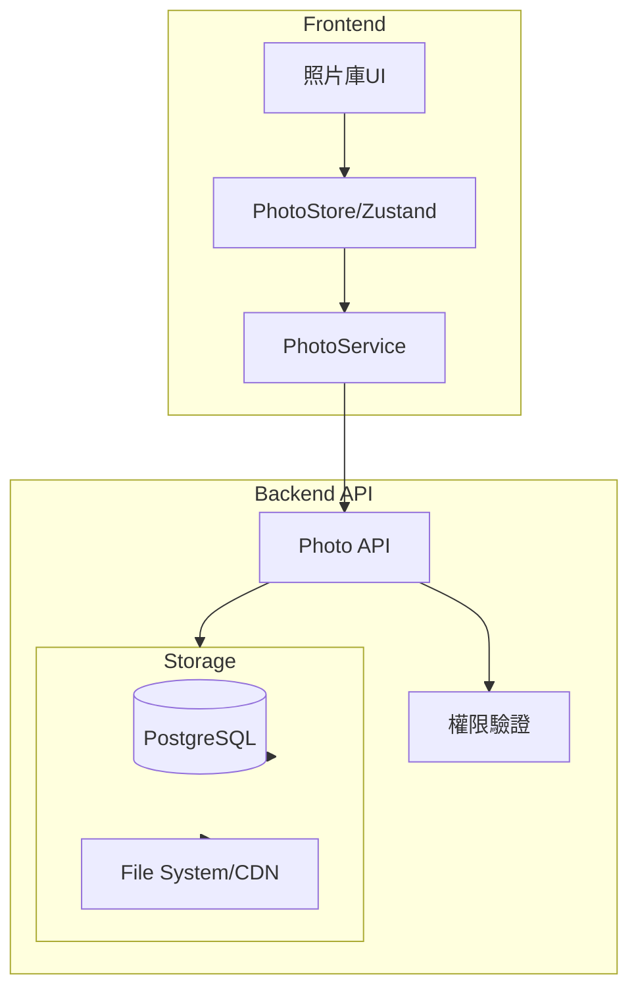
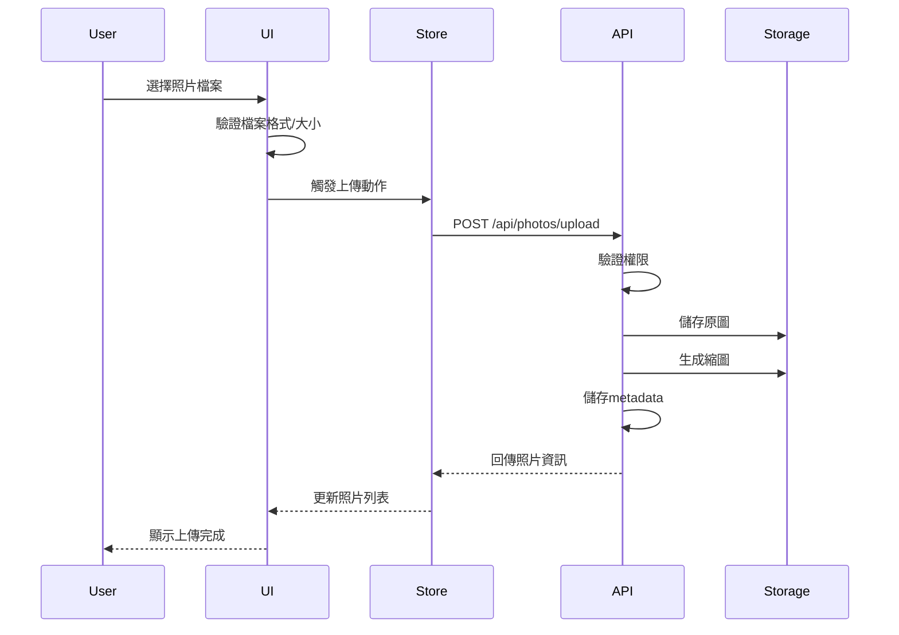
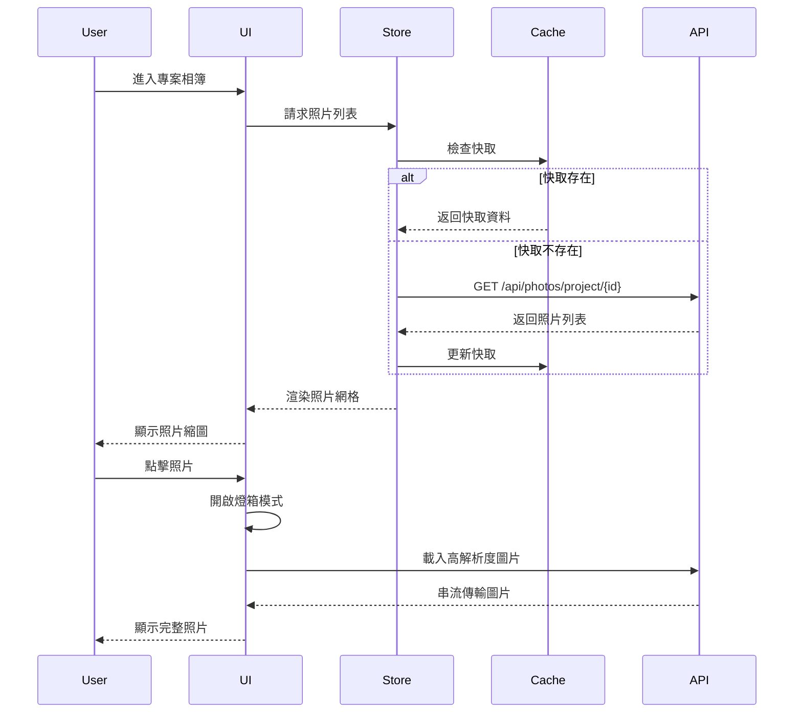

# Technical Design Document

## 概述

**目的**: 工程照片庫功能為PCM平台提供現代化的照片管理解決方案，讓專案團隊能夠有效地組織、瀏覽和管理工程現場照片。

**使用者**: 專案管理人員、工程師、廠商承包商將使用此功能來上傳施工進度照片、查看工程記錄和下載報告所需的照片檔案。

**影響**: 此功能將替代現有的靜態文件管理方式，提供類似Google相簿的直觀體驗，改善工程照片的可存取性和組織結構。

### 目標
- 提供基於專案的照片分類與管理
- 實現現代化的照片瀏覽體驗與燈箱預覽
- 支援批量上傳與下載功能
- 確保基於角色的存取控制

### 非目標
- 不包含影片上傳和播放功能
- 不提供照片編輯功能（裁切、旋轉、濾鏡）
- 不支援即時協作編輯或標註
- 暫不整合第三方雲端儲存服務

## 架構

### 現有架構分析

現有PCM系統採用下列架構模式：
- **前端架構**: Next.js 15 App Router + TypeScript + shadcn/ui
- **狀態管理**: Zustand進行全局狀態管理
- **API層**: Service層模式，支援Mock和真實API切換
- **認證機制**: JWT token基礎的身份驗證
- **路由結構**: 基於專案的巢狀路由 `/dashboard/[projectId]/...`

整合點：
- 導航系統: 整合至 `communication-management` 模組下
- 權限系統: 複用現有的專案權限控制
- UI元件: 使用現有的shadcn/ui元件系統

### 高層架構



### 技術對齊

**與現有技術棧的整合**：
- 遵循現有的Next.js App Router架構模式
- 使用TypeScript嚴格類型定義
- 整合shadcn/ui元件庫保持UI一致性
- 採用Zustand進行狀態管理保持架構統一

**新增依賴**：
- `yet-another-react-lightbox`: 現代化照片燈箱元件
- `react-dropzone`: 拖放上傳功能
- `sharp`: 服務端圖片處理與縮圖生成

### 關鍵設計決策

**決策1: 照片儲存策略**
- **背景**: 需要儲存大量工程照片並支援快速存取
- **選項**: 本地檔案系統、雲端儲存(S3)、混合方案
- **選擇方案**: 混合方案 - 原圖儲存在檔案系統，縮圖和metadata儲存在資料庫
- **理由**: 平衡成本與效能，利用CDN加速縮圖載入，原圖按需載入
- **權衡**: 增加儲存管理複雜度，但獲得更好的效能和彈性

**決策2: 圖片載入策略**
- **背景**: 單一專案可能包含數百張照片，需要優化載入效能
- **選項**: 一次載入全部、分頁載入、虛擬滾動
- **選擇方案**: 虛擬滾動結合懶載入
- **理由**: 提供最佳的使用者體驗，減少初始載入時間
- **權衡**: 實作複雜度較高，但大幅提升效能

**決策3: 權限控制粒度**
- **背景**: 需要控制不同角色對照片的存取權限
- **選項**: 專案級權限、相簿級權限、照片級權限
- **選擇方案**: 專案級權限
- **理由**: 與現有權限系統整合最簡單，滿足當前需求
- **權衡**: 犧牲細粒度控制，但降低複雜度

## 系統流程

### 照片上傳流程



### 照片瀏覽流程



## 需求追溯

| 需求 | 需求摘要 | 元件 | 介面 | 流程 |
|------|---------|------|------|------|
| 1.1 | 顯示專案相簿列表 | PhotoGalleryList | PhotoService.getProjectAlbums() | 照片瀏覽流程 |
| 1.3 | 顯示照片縮圖網格 | PhotoGrid | PhotoStore.getPhotos() | 照片瀏覽流程 |
| 2.1 | 多檔案上傳 | PhotoUploader | PhotoService.uploadPhotos() | 照片上傳流程 |
| 3.2 | 燈箱預覽模式 | PhotoLightbox | - | 照片瀏覽流程 |
| 4.2 | 下載原始照片 | PhotoActions | PhotoService.downloadPhoto() | - |
| 5.1 | 搜尋篩選功能 | PhotoFilters | PhotoStore.filterPhotos() | - |
| 6.1 | 權限驗證 | - | AuthService.verifyAccess() | 所有流程 |

## 元件與介面

### 前端層

#### PhotoGallery主元件

**責任與邊界**
- **主要責任**: 管理照片庫的整體佈局和導航
- **領域邊界**: 溝通管理模組/照片管理子域
- **資料所有權**: 不擁有資料，協調其他元件
- **交易邊界**: 無交易處理

**相依性**
- **輸入**: MainNavigation、DashboardLayout
- **輸出**: PhotoGalleryList、PhotoGrid、PhotoLightbox
- **外部**: yet-another-react-lightbox、react-dropzone

**服務介面**
```typescript
interface PhotoGalleryProps {
  projectId: string
  userId: string
  permissions: ProjectPermissions
}

interface PhotoGalleryState {
  selectedAlbum: string | null
  viewMode: 'grid' | 'list'
  lightboxOpen: boolean
  selectedPhotoIndex: number
}
```

#### PhotoUploader元件

**責任與邊界**
- **主要責任**: 處理照片上傳邏輯和UI互動
- **領域邊界**: 照片管理子域/上傳功能
- **資料所有權**: 暫存上傳佇列資料
- **交易邊界**: 批次上傳的原子性

**相依性**
- **輸入**: PhotoGallery
- **輸出**: PhotoService、PhotoStore
- **外部**: react-dropzone

**服務介面**
```typescript
interface PhotoUploaderService {
  validateFiles(files: File[]): ValidationResult
  compressImage(file: File): Promise<Blob>
  uploadBatch(files: UploadFile[]): Promise<UploadResult[]>
  cancelUpload(uploadId: string): void
}

interface UploadFile {
  id: string
  file: File
  projectId: string
  metadata: PhotoMetadata
  progress: number
  status: 'pending' | 'uploading' | 'completed' | 'failed'
}
```

**前置條件**: 使用者具有專案上傳權限
**後置條件**: 照片成功儲存並可在相簿中顯示

### 資料層

#### PhotoStore (Zustand)

**責任與邊界**
- **主要責任**: 管理照片相關的客戶端狀態
- **領域邊界**: 前端狀態管理層
- **資料所有權**: 照片列表、篩選狀態、上傳佇列
- **交易邊界**: 無，純狀態管理

**狀態介面**
```typescript
interface PhotoStoreState {
  // 核心資料
  photos: Photo[]
  albums: Album[]
  currentAlbum: string | null

  // 載入狀態
  loading: boolean
  error: string | null

  // 篩選與搜尋
  filters: PhotoFilters
  searchQuery: string

  // 上傳狀態
  uploadQueue: UploadFile[]
  uploadProgress: Record<string, number>

  // Actions
  loadPhotos: (projectId: string) => Promise<void>
  uploadPhotos: (files: File[]) => Promise<void>
  deletePhoto: (photoId: string) => Promise<void>
  setFilter: (filter: Partial<PhotoFilters>) => void
  searchPhotos: (query: string) => void
}
```

### API層

#### Photo API契約

| 方法 | 端點 | 請求 | 回應 | 錯誤 |
|------|------|------|------|------|
| GET | /api/projects/{id}/photos | - | Photo[] | 401, 403, 500 |
| POST | /api/projects/{id}/photos/upload | FormData | UploadResult | 400, 401, 413, 500 |
| GET | /api/photos/{id}/download | - | Binary | 401, 404, 500 |
| DELETE | /api/photos/{id} | - | Success | 401, 403, 404, 500 |
| GET | /api/photos/{id}/thumbnail | size? | Binary | 404, 500 |

**請求/回應結構**
```typescript
interface UploadRequest {
  files: File[]
  projectId: string
  albumName?: string
  metadata?: PhotoMetadata
}

interface UploadResult {
  success: boolean
  photoId: string
  thumbnailUrl: string
  originalUrl: string
  metadata: PhotoMetadata
  errors?: string[]
}

interface Photo {
  id: string
  projectId: string
  albumName: string
  fileName: string
  fileSize: number
  mimeType: string
  width: number
  height: number
  thumbnailUrl: string
  originalUrl: string
  uploadedBy: string
  uploadedAt: Date
  metadata: PhotoMetadata
}
```

## 資料模型

### 邏輯資料模型

**實體關係**
- Project (1) ←→ (N) Album
- Album (1) ←→ (N) Photo
- User (1) ←→ (N) Photo (上傳者)
- Photo (1) ←→ (N) PhotoVersion (不同解析度)

**屬性定義**
```typescript
interface Album {
  id: string
  projectId: string
  name: string
  description?: string
  coverPhotoId?: string
  photoCount: number
  createdAt: Date
  updatedAt: Date
}

interface PhotoMetadata {
  exifData?: ExifData
  location?: GeoLocation
  tags?: string[]
  description?: string
  capturedAt?: Date
  cameraModel?: string
}
```

### 物理資料模型

**資料表結構**
```sql
-- 相簿表
CREATE TABLE photo_albums (
  id UUID PRIMARY KEY DEFAULT gen_random_uuid(),
  project_id VARCHAR(20) REFERENCES projects(id),
  name VARCHAR(255) NOT NULL,
  description TEXT,
  cover_photo_id UUID,
  photo_count INT DEFAULT 0,
  created_at TIMESTAMP DEFAULT CURRENT_TIMESTAMP,
  updated_at TIMESTAMP DEFAULT CURRENT_TIMESTAMP,
  INDEX idx_project_id (project_id)
);

-- 照片表
CREATE TABLE photos (
  id UUID PRIMARY KEY DEFAULT gen_random_uuid(),
  album_id UUID REFERENCES photo_albums(id),
  file_name VARCHAR(255) NOT NULL,
  file_path TEXT NOT NULL,
  file_size BIGINT NOT NULL,
  mime_type VARCHAR(100),
  width INT,
  height INT,
  thumbnail_path TEXT,
  uploaded_by VARCHAR(20) REFERENCES users(id),
  uploaded_at TIMESTAMP DEFAULT CURRENT_TIMESTAMP,
  metadata JSONB,
  deleted_at TIMESTAMP,
  INDEX idx_album_id (album_id),
  INDEX idx_uploaded_at (uploaded_at),
  INDEX idx_deleted (deleted_at)
);

-- 照片版本表 (不同解析度)
CREATE TABLE photo_versions (
  id UUID PRIMARY KEY DEFAULT gen_random_uuid(),
  photo_id UUID REFERENCES photos(id),
  version_type VARCHAR(20), -- 'thumbnail', 'medium', 'large', 'original'
  file_path TEXT NOT NULL,
  width INT,
  height INT,
  file_size BIGINT,
  INDEX idx_photo_version (photo_id, version_type)
);
```

## 錯誤處理

### 錯誤策略
照片庫採用漸進式錯誤恢復策略，優先保證核心功能可用，對非關鍵錯誤進行優雅降級。

### 錯誤類別與回應

**使用者錯誤 (4xx)**
- 檔案格式不支援 → 顯示支援格式清單
- 檔案大小超限 → 提供壓縮選項或分批上傳建議
- 無權限存取 → 引導至權限申請流程

**系統錯誤 (5xx)**
- 儲存空間不足 → 通知管理員，暫停上傳功能
- 縮圖生成失敗 → 顯示預設圖示，背景重試
- API逾時 → 自動重試3次，失敗後顯示離線模式

**業務邏輯錯誤 (422)**
- 重複檔案 → 詢問是否覆蓋或重新命名
- 相簿已滿 → 提示建立新相簿或清理舊照片

### 監控
- 使用現有的錯誤追蹤系統記錄所有錯誤
- 關鍵指標：上傳成功率、API回應時間、縮圖生成時間
- 錯誤警報：連續失敗超過閾值時通知維運團隊

## 測試策略

### 單元測試
- PhotoService方法：validateFiles、compressImage、generateThumbnail
- PhotoStore actions：loadPhotos、filterPhotos、uploadPhotos
- 工具函數：formatFileSize、validateImageFormat、extractEXIF

### 整合測試
- 照片上傳完整流程：選擇檔案→上傳→生成縮圖→顯示
- 權限控制：不同角色存取照片的權限驗證
- 搜尋篩選：關鍵字搜尋、日期篩選、組合條件

### E2E測試
- 使用者上傳照片並在相簿中查看
- 照片燈箱預覽和鍵盤導航
- 批次下載多張照片
- 響應式佈局在不同裝置的顯示

### 效能測試
- 載入100+張照片的渲染效能
- 大檔案(10MB+)上傳處理
- 並發上傳多個檔案
- 虛擬滾動的流暢度

## 安全性考量

### 認證與授權
- 複用現有JWT token認證機制
- 基於專案權限控制照片存取
- 廠商只能上傳至被指派的專案

### 資料保護
- 檔案上傳使用HTTPS加密傳輸
- 儲存前驗證檔案類型防止惡意檔案
- 實施檔案大小限制防止DoS攻擊
- 敏感EXIF資訊(GPS座標)的選擇性移除

### 存取控制
- 照片URL使用簽名防止未授權存取
- 實施rate limiting防止大量下載
- 定期清理已刪除照片的實體檔案

## 效能與擴展性

### 目標指標
- 頁面初始載入 < 2秒
- 照片縮圖載入 < 500ms
- 燈箱開啟 < 300ms
- 支援單一相簿1000+張照片

### 擴展策略
- **水平擴展**: 照片儲存可分散至多個儲存節點
- **CDN整合**: 縮圖透過CDN加速全球存取
- **快取策略**:
  - 客戶端：IndexedDB快取最近瀏覽的照片
  - 服務端：Redis快取熱門照片metadata
  - CDN：靜態資源長期快取

### 優化技術
- 圖片懶載入與虛擬滾動
- 漸進式JPEG載入提升感知效能
- WebP格式支援減少傳輸大小
- 響應式圖片提供多種解析度